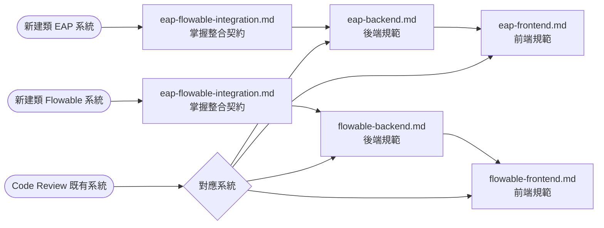
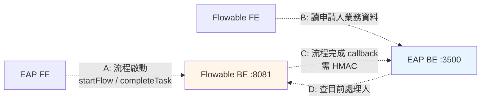

# EAP × Flowable 系統架構規範總覽

| 項目 | 內容 |
| --- | --- |
| **文件編號** | EAP-FLOW-INDEX-001 |
| **目的** | 統一管理「類 EAP 業務系統」與「類 Flowable 工作流系統」的可重用架構規範 |
| **適用對象** | 後端 / 前端開發、架構師、Code Reviewer、新進人員 |
| **生效日期** | 2026-04-30 |

---

## 0. 文件定位

本資料夾收錄的**不是**「目前 EAP 與 Flowable 專案的現況描述」，而是「**未來新建類 EAP 或類 Flowable 系統時可重用的架構規範**」。

- 當前 `EAP_Group/eap` 與 `flowable/` 視為各自的 **Reference Implementation #1**
- 每章採三段式：**規範**（新專案必守）→ **現況落差**（Reference Implementation 與規範的偏離，附 `file_path:line` 證據）→ **建議增強**（選用，由作者判斷對新專案的 ROI）
- 規範段已將 [`project-init.md`](../project-init.md) 的 Spring Boot 概念**轉換為 Quarkus 等價物**，並**未把後端 Hexagonal/Modulith 強塞至前端**

> 換句話說：未來若新建一個「類似 EAP 的人事系統」或「類似 Flowable 的審批系統」，**這份規範是它應遵守的起點藍本**；既有 EAP / Flowable 是「已部分達成」的對照組。

---

## 1. 適用範圍

| 系統類型 | 定位 | 技術骨幹 |
| --- | --- | --- |
| **類 EAP 系統** | 業務領域系統（人事、財務、招募、考勤等業務本身） | 後端：Quarkus + Apache Camel + Panache + 多 Schema MSSQL；前端：Vue 3 + Quasar + TS strict |
| **類 Flowable 系統** | 集中式工作流引擎服務（為多個業務系統提供 BPMN 簽核能力） | 後端：Quarkus + Apache Camel + Flowable BPMN Engine + 雙 Schema MSSQL；前端：Vue 3 + Quasar + TS strict |

**兩者的關係**：類 EAP 系統會把「需要簽核的流程」委託給類 Flowable 系統；類 Flowable 系統在流程結束時 callback 通知類 EAP 寫業務生效資料。整合契約見 [`eap-flowable-integration.md`](./eap-flowable-integration.md)。

---

## 2. 文件導引

| 文件 | 適用對象 | 何時讀 | 行數 |
| --- | --- | --- | --- |
| [`eap-backend.md`](./eap-backend.md) | 後端開發、架構師 | 新建類 EAP 後端 / Code Review 既有 EAP 後端 | ~516 |
| [`eap-frontend.md`](./eap-frontend.md) | 前端開發 | 新建類 EAP 前端 / Code Review 既有 EAP 前端 | ~416 |
| [`flowable-backend.md`](./flowable-backend.md) | 後端開發 | 新建類 Flowable 後端 / 評估第三方流程引擎接入 | ~462 |
| [`flowable-frontend.md`](./flowable-frontend.md) | 前端開發 | 新建類 Flowable 前端（流程申請與簽核 UI） | ~413 |
| [`eap-flowable-integration.md`](./eap-flowable-integration.md) | 兩端共讀、架構師 | 整合任一新系統與既有對端 / Review 整合契約變更 | ~450 |

**規範總計約 2,250 行**。每份文件可獨立閱讀，但建議至少把 `eap-flowable-integration.md` 看一遍以掌握跨系統契約。

---

## 3. 推薦閱讀順序



**新人 onboarding 順序**：先讀 README → 讀對應系統的 backend → 讀對應系統的 frontend → 整合面選讀。

> 💡 **SSO 啟用提示**：若新類 EAP 系統需要對接企業 IdP（Azure AD / Okta / Keycloak 等），請額外閱讀 [`eap-backend.md` §8 SSO 整合（選用）](./eap-backend.md#8-sso-整合選用) 與 [`eap-frontend.md` §7.4 SSO 登入流程（選用）](./eap-frontend.md#74-sso-登入流程選用)。類 Flowable 端**不需**任何配合改動（見 [`eap-flowable-integration.md` §3 開頭聲明](./eap-flowable-integration.md#3-認證鏈路與-token-共享)）。

---

## 4. 三段式結構約定

每份文件除少數無落差章節（如「技術骨幹」）外，**所有章節遵循同一 pattern**，便於跨文件對照：

```text
## N. 主題

### N.1 規範
新類 EAP / 類 Flowable 系統必須遵守的條款。
作為樣板由此抄起。

### N.2 現況落差
當前 Reference Implementation 與規範的偏離。
附 file_path:line 證據。
新專案應在第一天即避開這些落差。

### N.3 建議增強（選用）
僅在對新專案 ROI 高時才寫。
不適用 Quarkus 的 Spring Boot 概念直接捨棄，不硬塞。

### N.4 實作參考（選用，僅新功能規範章節適用）
當該章節是「新功能規範」（當前 Reference Impl 尚未實作），
N.2 現況落差通常為「N/A — 尚未實作」。
此時可額外附 N.4 提供具體技術選型與流程範例
（如 §8.4 OIDC Authorization Code + PKCE）。
規範段保持協議無關，實作參考段給優先建議。
```

**嚴重性標記**：
- 🔴 高嚴重性 — 安全 / 資料正確性 / 系統可用性風險。新專案**必須**避免
- 🟡 中嚴重性 — 維運 / 一致性 / 維護成本問題。新專案**建議**避免
- ⚠️ 低嚴重性 — 風格 / 可讀性議題
- ✅ 已遵守規範

---

## 5. 高嚴重性發現速查（🔴 跨文件彙整）

下表彙整 5 份文件中所有 🔴 級別發現，新類 EAP / 類 Flowable 系統開發時務必避開。**既有 EAP / Flowable 專案則為待改善 backlog**。

| # | 議題 | 影響 | 來源章節 | 建議改善 |
| --- | --- | --- | --- | --- |
| **1** | **Flowable 前端 auth guard 被註解** | 任何人不需登入即可導航到 Portal、ApplicationProcess、RoleManagement 等受保護頁面 | [flowable-frontend §7.2](./flowable-frontend.md#72-現況落差) | 恢復 `router.beforeEach`；CI 加 grep 檢查確保此段未被註解（R7-1） |
| **2** | **Callback 機制無 HMAC 簽章** | 任何能 reach 到 EAP backend 3500 port 的人都能**偽造 callback 觸發離職、留停、insurance history 寫入**等業務副作用 | [eap-backend §7.2](./eap-backend.md#72-現況落差) / [flowable-backend §6.2](./flowable-backend.md#62-現況落差) / [integration §4.2](./eap-flowable-integration.md#42-現況落差) | 兩端同時部署 HMAC 簽章；secret 由共用 ENV 變數注入（R4-1, R4-2） |
| **3** | **Flowable 後端白名單過大** | `startFlow`、`completeTask`、`auditFlow` 等核心操作列為公開，**不需 JWT 即可呼叫**，跨系統 token 流通價值被削弱 | [flowable-backend §7.2](./flowable-backend.md#72-現況落差) / [integration §3.2](./eap-flowable-integration.md#32-現況落差) | 縮減白名單僅保留登入與健康檢查；補齊前端 token forward 機制（R7-1, R3-1） |
| **4** | **Flowable 前端 SBtn 無權限保護** | 與類 EAP 前端的 SBtn 同名但實作不同，受保護按鈕在 Flowable 前端形同虛設 | [flowable-frontend §8.2](./flowable-frontend.md#82-現況落差) | SBtn 機制兩端對齊；建議抽到內部 npm package 共用（R8-1, R8-2） |
| **5** | **EAP / Flowable 後端均無 DTO** | 全部以 `Map<String, Object>` 流通，編譯期無型別保護；Swagger 失準；重構欄位需全文搜尋字串 | [eap-backend §5.2](./eap-backend.md#52-現況落差) / [flowable-backend §8.2](./flowable-backend.md#82-現況落差) | 用 Java 17 `record` 定義 Request / Response；採 MapStruct 處理 DTO ↔ Entity（R5-1 ~ R5-3） |
| **6** | **EAP 前端 SBtn permission-id 寫成條件運算式** | `pages/au/au002/AU002.vue:177` 的 `permission-id="btnResendEmail && props.row.emailVerified === 'N'"`，`&&` 結果是 boolean，永遠拿不到對應權限 | [eap-frontend §6.2](./eap-frontend.md#62-現況落差) | 條件式改用 `v-if`，permission-id 保持單一字串；SBtn 加 dev-mode 警告；CI grep 檢查（R6-1, R6-2） |
| **7** | **Flowable 前端 `<script setup>` 採用率僅 33%** | 99 個檔案僅 33 個用 setup syntax，其餘混用 setup 函式 / Options API。與類 EAP 前端 100% 形成強烈對比，跨專案開發者切換錯亂 | [flowable-frontend §1.2](./flowable-frontend.md#12-現況落差) | 規定新建一律 `<script setup>`；既有檔下次修改時順手轉換（R1-1） |

> 📌 **改善優先順序建議**：#1 / #2 / #3 屬安全議題，必須優先處理；#4 / #5 屬架構欠債，計入下一個 sprint；#6 / #7 屬一致性議題，可在常規 maintenance 中清掉。

---

## 6. 變更歷程

| 版本 | 日期 | 變更摘要 | 變更者 |
| --- | --- | --- | --- |
| 1.0.0 | 2026-04-30 | 初版發佈：5 份規範文件 + README 索引；定義三段式結構與 🔴 速查機制 | 架構整理 |
| 1.1.0 | 2026-04-30 | §3 推薦閱讀加 SSO 啟用提示；§4 三段式結構新增 N.4 實作參考延伸（搭配 eap-backend §8 SSO 整合） | 架構整理 |

---

## 附錄：常用對照

### A. Spring Boot → Quarkus 概念對照

| Spring Boot | Quarkus 等價 |
| --- | --- |
| `@Service` / `@Component` | `@ApplicationScoped` |
| `@Repository` | `PanacheRepository` / `PanacheRepositoryBase` |
| `@Configuration` | `@Produces` + `@ConfigProperty` |
| `@RestController` | JAX-RS `@Path` 或 Camel REST DSL |
| Spring Profile (`@Profile("dev")`) | Quarkus Profile (`%dev.`) |
| `@ConditionalOnMissingBean` | `@DefaultBean` / `@Alternative` |
| Spring Modulith | **無直接對等**，以 `package-info.java` + ArchUnit 替代 |

### B. Port 與部署位置

| 系統 | dev port | 用途 |
| --- | --- | --- |
| EAP Backend | **3500** | 類 EAP 業務 API |
| EAP Frontend | 9000 | Quasar dev server |
| Flowable Backend | **8081** | 類 Flowable 工作流 API |
| Flowable Frontend | 9000 | Quasar dev server |

⚠️ **注意**：EAP `CLAUDE.md` 文件中標 8081 已過時，實際 port 為 3500（見 `EAP_Group/eap/backend/application/src/main/resources/application.properties:4`）。

### C. 整合接觸面（4 條 HTTP 路徑）



詳見 [`eap-flowable-integration.md §2`](./eap-flowable-integration.md#2-整合接觸面touchpoints--唯一允許的四條路徑)。
