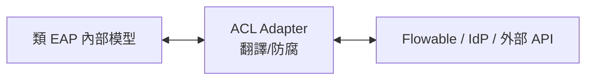
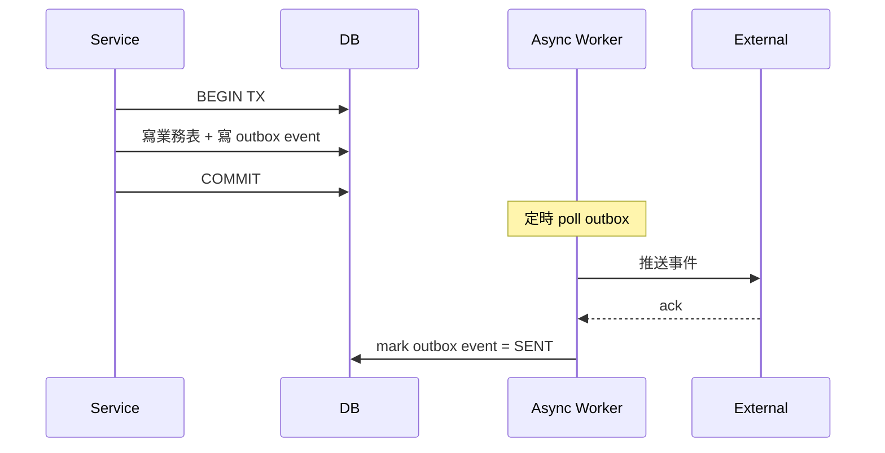
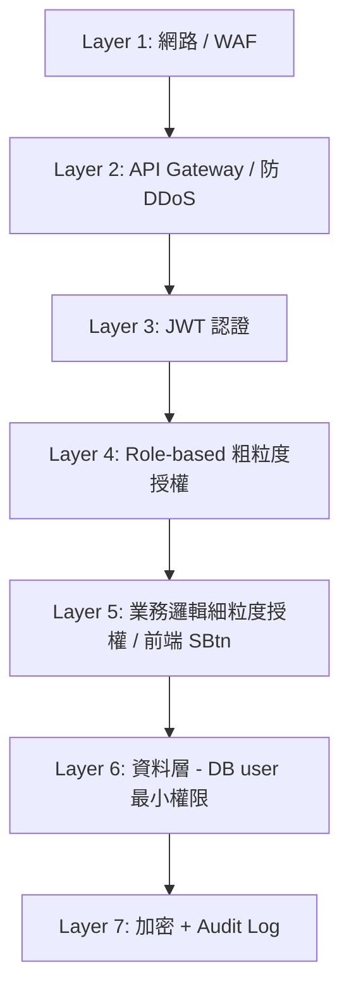

# 類 EAP 系統架構原則總覽

← [返回架構規範總覽](./README.md)

| 項目 | 內容 |
| --- | --- |
| **文件編號** | EAP-ARCH-PRIN-001 |
| **適用範圍** | 類 EAP 業務系統的架構性檢核清單。彙整 17 條原則並對照當前 EAP 現況，作為新類 EAP 專案的設計依據與既有 EAP 的改善 backlog |
| **參考實作** | `/Users/ryan/Coding/Soetek/EAP_Group/eap`（Reference Implementation #1） |
| **與其他文件關係** | 補充 [`eap-backend.md`](./eap-backend.md) 的章節規範；本文件偏向**原則導向（principle-oriented）**，後者偏向**模組導向（module-oriented）** |
| **生效日期** | 2026-05-03 |

---

## 0. 文件定位與閱讀方式

本文件**彙整 17 條架構性原則**，每條一律採三段式：

```text
N.1 規範        ─ 原則本身在類 EAP 上下文中的具體含意（Quarkus 已翻譯版本）
N.2 現況落差    ─ 當前 EAP 程式碼是否遵守，附 file_path:line 證據
N.3 建議增強    ─ 對新類 EAP 系統 ROI 高的具體做法
```

**與 [`eap-backend.md`](./eap-backend.md) 的分工**：
- `eap-backend.md` 從**模組層次**展開（API 入口、Processor、DTO、多 Schema、認證 …）
- 本文件從**原則層次**展開（六邊形、CA、SOLID、DDD、套件設計、韌性、安全 …）
- 同一個違反可能在兩文件都被點到，但討論視角不同

**嚴重性標記**（沿用 README §4 約定）：🔴 高 / 🟡 中 / ⚠️ 低 / ✅ 已遵守

---

## 索引

| # | 原則 | 類型 | 嚴重性 | 章節 |
| --- | --- | --- | --- | --- |
| 1 | Hexagonal Architecture | 經典 | 🔴 | [§1](#1-六邊形架構hexagonal-architecture) |
| 2 | Clean Architecture | 經典 | 🔴 | [§2](#2-clean-architecturecaa) |
| 3 | SOLID（5 子原則） | 經典 | 🟡 | [§3](#3-solid-原則) |
| 4 | DDD: Rich Domain Model | 領域建模 | 🟡 | [§4](#4-rich-domain-model反-anemic) |
| 5 | ACL: Anti-Corruption Layer | 領域建模 | 🟡 | [§5](#5-acl-anti-corruption-layer防腐層) |
| 6 | ADP: Acyclic Dependencies | 套件設計 | 🟡 | [§6](#6-adp-acyclic-dependencies-principle) |
| 7 | CCP: Common Closure | 套件設計 | 🟡 | [§7](#7-ccp-common-closure-principle) |
| 8 | SDP: Stable Dependencies | 套件設計 | ⚠️ | [§8](#8-sdp-stable-dependencies-principle) |
| 9 | Idempotency | 一致性 | 🔴 | [§9](#9-idempotency冪等性) |
| 10 | Circuit Breaker / Bulkhead / Retry | 韌性 | 🟡 | [§10](#10-circuit-breaker--bulkhead--retry) |
| 11 | Outbox Pattern | 一致性 | 🟡 | [§11](#11-outbox-pattern) |
| 12 | API Versioning | API 設計 | 🟡 | [§12](#12-api-versioning) |
| 13 | DRY | 通用 | 🟡 | [§13](#13-drydont-repeat-yourself) |
| 14 | Law of Demeter | 通用 | 🟡 | [§14](#14-law-of-demeter最少知識原則) |
| 15 | Defense in Depth | 安全 | 🔴 | [§15](#15-defense-in-depth縱深防禦) |
| 16 | Least Privilege | 安全 | 🔴 | [§16](#16-least-privilege最小權限) |
| 17 | 12-Factor App (Dev/Prod Parity) | 運維 | 🟡 | [§17](#17-12-factor-app-devprod-parity) |

---

# 第一部分：經典原則

## 1. 六邊形架構（Hexagonal Architecture）

### 1.1 規範

Domain / Application 為「核心六邊形」，**完全不知道外部世界存在**；Infrastructure 為「外部六邊形」，透過 Port 連接。所有外部依賴（DB / Cache / MQ / 外部 HTTP）皆視為**可替換的 Adapter**。

每個 Port 必須至少有兩個實作：
- **Real Adapter**：實際整合外部服務
- **Null Adapter**：外部服務不可用時的空實作（不拋例外，靜默忽略或回安全預設值）

> 詳細規範見 [`eap-backend.md` §3](./eap-backend.md#3-api-入口統一模式核心模式) 與 [§9](./eap-backend.md#9-與-flowable-的整合)。

### 1.2 現況落差 🔴

`Rm003PersonRequestService.java:53-62, 172-219` 直接持有 `java.net.http.HttpClient` 並呼叫 Flowable，**無 Port 抽象**：

```java
@ApplicationScoped
public class Rm003PersonRequestService {        // Service 層
    @Inject @PersistenceUnit("eap")
    EntityManager eapEntityManager;             // 直接抓持久化引擎

    @ConfigProperty(name = "flowable.api.base-url")
    String flowableApiBaseUrl;                  // 直接吃外部 URL

    private final HttpClient httpClient =       // 直接自建 HttpClient
        HttpClient.newBuilder()...build();
}
```

Flowable 不在線時無 Null Adapter 自動接管，靠每個跨系統呼叫各自 `try/catch` 內聯降級。

### 1.3 建議增強

- 抽 `FlowableClientPort`（domain）+ `FlowableHttpAdapter`（infra/real）+ `NullFlowableAdapter`（infra/null）
- 用 `@DefaultBean` / `@LookupIfProperty` 控制 Adapter 載入

---

## 2. Clean Architecture（CA）

### 2.1 規範

層次依賴**只能由外往內**：API → Application → Domain，Infrastructure 在最外層實作 Domain 定義的 Port。
- Domain 不依賴 Spring / JPA / Security 等框架
- API payload **不可** 以 `Map<String, Object>` 進入 Application 層
- 同層之間（同為 Domain 但**不同 Bounded Context**）禁止跨界直接依賴對方的 Entity；跨模組資料應透過 Port 取得並以 DTO 傳遞

### 2.2 現況落差 🔴

`PmEmployeeMapper.java:8-17` 跨 5 個 Bounded Context import Entity：

```java
import org.soetek.eap.au013.domain.AuOrganizationEntity;       // 跨界
import org.soetek.eap.au013.domain.AuOrgUserEntity;            // 跨界
import org.soetek.eap.rm003.domain.RmJobTitleEntity;           // 跨界
import org.soetek.eap.rm001.domain.RmPersonCertificateEntity;  // 跨界
import org.soetek.eap.rm001.domain.RmPersonEducation;          // 跨界
import org.soetek.eap.rm001.domain.RmPersonExperienceEntity;   // 跨界
import org.soetek.eap.rm001.domain.RmPersonFamilyEntity;       // 跨界
import org.soetek.eap.demo.domain.AuFileInfoEntity;            // 跨界
import org.soetek.eap.rm001.domain.RmPersonLanguageEntity;     // 跨界
import org.soetek.eap.rm001.util.AesEncryptionUtil;            // 跨界連 util 都直接抓
```

`au013` 改欄位名稱、`rm001` 重構 Entity → `pm001` 編譯就斷。

### 2.3 建議增強

- 每模組對外提供 `api/spi/{Module}QueryPort.java` 介面 + DTO
- pm001 依賴 Port 而非具體 Entity
- 共用 util（`AesEncryptionUtil`）下放到 `common/security` 模組

---

## 3. SOLID 原則

### 3.1 規範

五條子原則：

| 子原則 | 簡述 |
| --- | --- |
| **SRP** Single Responsibility | 一個類別只應有一個改變的理由 |
| **OCP** Open/Closed | 對擴展開放，對修改封閉（用 Strategy / 多型擴展，不用 if-else 累積） |
| **LSP** Liskov Substitution | 子類別必須能替換父類別且不破壞契約 |
| **ISP** Interface Segregation | 客戶端不該被迫依賴它不使用的方法 |
| **DIP** Dependency Inversion | 高層模組不該依賴低層模組，兩者都應依賴抽象 |

### 3.2 現況落差

#### 3.2.1 SRP 🟡 — `TmLeaveCreateService`

`TmLeaveCreateService.java:34-46` 類別 Javadoc 自承 9 個責任：

```java
/**
 * TM003 建立請假單服務層
 * 負責處理請假單的建立邏輯，包含：
 * 1. 員工年度假別額度驗證（存在性、未結算）
 * 2. 代理員工驗證（在職、非本人）
 * 3. 假別設定明細驗證
 * 4. 請假區間驗證（批次內部重疊 + 歷史記錄重疊）
 * 5. 請假時數驗證（最小時數、剩餘額度）
 * 6. 建立多筆 TM_EMP_LEAVE 記錄
 * 7. 即時扣除 TM_EMP_VACATION 額度
 * 8. 附件處理（Base64 解碼寫入磁碟 + 寫入 AU_FILE_INFO）
 * 9. 預留 Flowable 通知擴展點
 */
```

每動一處都有「碰壞別處」的風險。

#### 3.2.2 OCP 🟡 — Mapper 內 if-else 分支

`PmEmployeeMapper.java` 等多處用 if-else 處理欄位映射條件分支。新增資料來源類型必須**修改既有 method**（違反 Open/Closed），而非新增 Strategy 實作。

#### 3.2.3 LSP ✅ — 暫無發現具體違反

當前 EAP 大多採組合（composition）而非深度繼承，LSP 風險低。`AuditableEapEntity` 之類的 `@MappedSuperclass` 屬於框架慣例，不算違反。

#### 3.2.4 ISP ⚠️ — 未充分顯現

當前 Service 介面少（多為類別直接 inject），ISP 暫不適用。**未來若隨抽 Port 而生大型介面**（例如把 WorkflowService 60+ 方法做成單一 interface），需特別注意按客戶端切分。

#### 3.2.5 DIP 🟡 — Processor / Service 直接依賴 ORM 與 HttpClient

`Rm003PersonRequestService.java:55, 60` 高層業務直接依賴低層基礎設施：

```java
@Inject @PersistenceUnit("eap") EntityManager eapEntityManager;  // 依賴 JPA 具體
private final HttpClient httpClient = HttpClient.newBuilder()...; // 依賴 HTTP 具體
```

業務層應依賴 `LeaveRepository`、`FlowableClientPort` 等抽象，而非 JPA / java.net.http 具體類別。

### 3.3 建議增強

- SRP：`TmLeaveCreateService` 拆 4 個協作者（Validator / Repository / VacationBalanceService / AttachmentPort）
- OCP：條件式映射改 Strategy 模式 + Factory 註冊
- DIP：所有外部依賴經 Port，搭配六邊形（§1）一起改

---

# 第二部分：領域建模（Domain Modeling）

## 4. Rich Domain Model（反 Anemic）

### 4.1 規範

Entity 應擁有**行為**，業務規則住在 Domain 而非 Service。Service 變薄、Entity 變厚（rich）。Tell, Don't Ask 的具體實踐。

```java
// ✅ Rich Domain
vacation.deduct(hours);               // Entity 自己決定能不能扣
order.applyDiscount(coupon);          // Entity 內含折扣規則

// ❌ Anemic Domain（資料容器）
if (vacation.unusedHours.compareTo(hours) >= 0) {  // Service 從外部判斷
    vacation.unusedHours = vacation.unusedHours.subtract(hours);
}
```

### 4.2 現況落差 🟡

EAP 所有 JPA Entity 都是純資料容器（fields + 預設 getter / setter），業務規則散在 Service。

`tm/domain/TmEmpVacationEntity.java`：

```java
@Entity
public class TmEmpVacationEntity extends AuditableEapEntity {
    public Integer empVacationId;
    public BigDecimal totalHours;
    public BigDecimal usedHours;
    public BigDecimal unusedHours;
    // ... 純 fields，無 canDeduct() / deduct() 等行為
}
```

而對應的判斷散落於 `TmLeaveCreateService.java:120`：

```java
validateHours(totalHours, detail.minHours, vacation.unusedHours);
//                                          ^^^^^^^^^^^^^^^^^^^^
//                                          Service 從 Entity 拉欄位做判斷
```

### 4.3 建議增強

```java
// 規則收進 Entity
public class TmEmpVacationEntity {
    public boolean canDeduct(BigDecimal hours, BigDecimal minHours) {
        if (hours.compareTo(minHours) < 0) return false;
        return unusedHours.compareTo(hours) >= 0;
    }
    public void deduct(BigDecimal hours) {
        if (!canDeduct(hours, BigDecimal.ZERO))
            throw new InsufficientVacationException();
        this.usedHours = this.usedHours.add(hours);
        this.unusedHours = this.unusedHours.subtract(hours);
    }
}

// Service 變薄
vacation.deduct(totalHours);  // Tell, Don't Ask
```

進階：把 `BigDecimal totalHours` 等改為 Value Object `LeaveHours`，內含「最小單位」「上限」等規則，連 BigDecimal 的計算也封裝。

---

## 5. ACL（Anti-Corruption Layer，防腐層）

### 5.1 規範

與外部系統整合時，建立 ACL 翻譯外部模型為內部模型。**外部格式變了，只改 ACL 一處**，業務邏輯零影響。



ACL 通常與六邊形的 Real Adapter 重疊，但職責**特別包含「容忍對方格式改變」**。

### 5.2 現況落差 🟡

`Rm003PersonRequestService.java:200-211` 內聯處理 Flowable 兩種可能的回傳格式：

```java
// 嘗試從 data 欄位取得，若無則直接使用 responseBody
Object data = responseBody.getOrDefault("data", responseBody);
if (data instanceof Map) {
    Map<String, String> result = new HashMap<>();
    ((Map<?, ?>) data).forEach((k, v) -> {
        if (v != null) result.put(k.toString(), v.toString());
    });
    return result;
}
```

註解「Flowable API 回傳格式可能是直接的 Map 或包裝在 data 中」本身就承認**沒有 ACL**。Flowable 改 wrapper 結構 → 這支 Service 要改。

### 5.3 建議增強

- 把 `parseHandlerResponse()` 抽到 `FlowableHttpAdapter` 內部（即六邊形的 Real Adapter）
- Service 只看到 `Map<String, String>`，不知道也不關心 Flowable 包不包 data
- 對外回傳改用內部 Value Object（如 `TaskHandlerInfo`）而非裸 Map，徹底切斷外部影響

---

# 第三部分：套件 / 模組設計

## 6. ADP（Acyclic Dependencies Principle）

### 6.1 規範

模組依賴圖必須是 DAG，**禁止循環依賴**。CI 自動偵測。

### 6.2 現況落差 🟡

當前盤點未發現循環，但**完全沒有 CI 防護**。風險點：

- `pm001` → `au013`、`rm001`、`rm003`、`demo`
- 若 `au013` 為了取「員工資訊」反向 import `pm001` → 立即循環

人為新增一個 import 就可能引入環，無自動偵測。

### 6.3 建議增強

CI 加 ArchUnit 測試：

```java
@AnalyzeClasses(packages = "org.soetek.eap")
class ArchitectureTest {
    @ArchTest
    static final ArchRule no_cycles =
        slices().matching("..eap.(*)..").should().beFreeOfCycles();
}
```

`mvn verify` 即跑，PR 帶入循環依賴自動 fail。

---

## 7. CCP（Common Closure Principle）

### 7.1 規範

因相同原因會一起變動的類別應放在同一個模組；不會一起變動的不該被綁在一起。

### 7.2 現況落差 🟡

`AuditableEapEntity`（所有業務模組的基底類）放在 `demo` 模組：

```text
backend/eap/demo/src/main/java/org/soetek/eap/demo/domain/AuditableEapEntity.java
                  ^^^^
                  「示範模組」變成「事實上的 foundation」
```

`tm`、`pm001`、`rm001` 的 Entity 都繼承 `demo.AuditableEapEntity`。但 demo 的職責（示範）與 AuditableEapEntity 的職責（共用基底）**不會一起改**——硬綁一起。

### 7.3 建議增強

抽出獨立 `eap-foundation` 模組：

```text
backend/
├── foundation/                       # HRM-side 基底
├── eap-foundation/                   # EAP-side 基底（新建）
│   └── src/main/java/.../AuditableEapEntity.java
├── demo/                             # 純粹示範，可隨時刪
└── {業務模組}/                        # 都改 import eap-foundation
```

---

## 8. SDP（Stable Dependencies Principle）

### 8.1 規範

依賴方向從不穩定指向穩定。被很多人依賴的模組（**穩定**）不該再依賴常變動的模組（**不穩定**）。

`I = Ce / (Ca + Ce)`，I 越接近 0 表示越穩定（多人依賴它，它依賴少數）。

### 8.2 現況落差 ⚠️

`demo` 模組同時：
- 被所有業務模組依賴（→ I ≈ 0，**穩定**屬性）
- 卻命名為「示範」（→ 暗示**不穩定**，可隨時刪除）

語意與依賴方向不一致。雖未實質產生 bug，但**新人會困惑**「為什麼示範模組不能刪？」

### 8.3 建議增強

與 §7 一併執行：抽出 `eap-foundation`（穩定且名實相符），`demo` 還原為真正的「示範」。

---

# 第四部分：資料一致性 / 跨系統可靠性

## 9. Idempotency（冪等性）

### 9.1 規範

可能被重送的請求（callback、retry、超時重試、Flowable engine 重啟）必須冪等：**同 key 重送結果不變**。

實作模式：以業務唯一鍵為 idempotency key，第一次處理寫入 history table；後續同 key 直接回前次結果。

### 9.2 現況落差 🔴

`Pm003WorkflowCallbackProcessor.java:91-94`：

```java
if ("historyOnly".equals(mode)) {
    return callbackService.writeInsuranceHistory(empAccount, effectiveDate);
}
return callbackService.onProcessCompleted(empAccount, effectiveDate, processType, resignType, leaveEndDate);
//     ^^^^^^^^^^^^^^^^^^^^^^^^^^^^^^^^^^
//     直接寫業務生效（離職、insurance）—— 沒查歷程表
```

Flowable engine 重啟、callback 失敗重發、人為重觸發都會**重複離職同一個員工 / 重複寫 insurance history**。

### 9.3 建議增強

建立去重表：

```sql
CREATE TABLE EAP.WORKFLOW_CALLBACK_HISTORY (
    proc_inst_id VARCHAR(64) NOT NULL,
    sheet_no VARCHAR(64) NOT NULL,
    process_definition_key VARCHAR(128) NOT NULL,
    received_at DATETIME2 NOT NULL DEFAULT SYSDATETIME(),
    result_code VARCHAR(32) NOT NULL,
    result_payload NVARCHAR(MAX),
    PRIMARY KEY (proc_inst_id)
);
```

callback handler 第一行：

```java
var existing = callbackHistoryRepo.findByProcInstId(procInstId);
if (existing.isPresent()) {
    log.info("[Callback] 重複請求，回前次結果 procInstId={}", procInstId);
    return existing.get().toResponse();
}
// ... 處理 + 寫入 history
```

---

## 10. Circuit Breaker / Bulkhead / Retry

### 10.1 規範

對外呼叫除了 timeout，還要：
- **Circuit Breaker**：連續失敗就熔斷一段時間（避免持續打死掉的服務）
- **Bulkhead**：隔離資源池（一個外部依賴慢不該拖垮所有 worker thread）
- **Retry with backoff**：暫時抖動可重試，搭配 jitter 避免雪崩

### 10.2 現況落差 🟡

`Rm003PersonRequestService.java:185, 215-218`：

```java
.timeout(Duration.ofMillis(flowableApiTimeout))   // ✓ timeout 有
// ... try {
//     ...
// } catch (Exception e) {
//     log.warn("[RM003] Flowable API 呼叫失敗，降級為不含目前處理者: {}", e.getMessage());
//     return Collections.emptyMap();              // ✓ 降級有
// }
```

只有 timeout + 內聯降級。**Flowable 持續掛 30 秒**：每次查單列表都打一次 → 慢使用者請求 + 拖累 Flowable 復活；無 Bulkhead → 可能拖垮所有 HTTP worker。

### 10.3 建議增強

導入 `quarkus-smallrye-fault-tolerance`：

```java
@ApplicationScoped
public class FlowableHttpAdapter implements FlowableClientPort {

    @Override
    @Timeout(3000)
    @CircuitBreaker(failureRatio = 0.5, requestVolumeThreshold = 10, delay = 30000)
    @Retry(maxRetries = 2, delay = 200, jitter = 100)
    @Bulkhead(value = 10)
    @Fallback(fallbackMethod = "fallback")
    public Map<String, String> getTaskCurrentHandlers(List<String> ids) {
        // ... HTTP call
    }

    Map<String, String> fallback(List<String> ids) {
        return Collections.emptyMap();
    }
}
```

成熟方案，零自寫程式碼。

---

## 11. Outbox Pattern

### 11.1 規範

「**DB 寫入成功 + 必須通知對方**」這種跨系統一致性，要先把事件**寫入同一個 transaction 的 outbox 表**，再由非同步 worker 發送。

避免「DB 寫成功但通知漏發」或「通知發出但 DB rollback」。



### 11.2 現況落差 🟡

流程啟動序列（見 [`eap-flowable-integration.md` §7](./eap-flowable-integration.md#7-流程啟動序列路徑-a-的展開)）：

```text
1. EAP FE → EAP BE: 建文件 + 配 sheetNo
2. EAP FE → Flowable BE: startFlow
3. EAP FE → EAP BE: 回寫 procInstId
```

如果第 3 步前端崩潰、網路斷、瀏覽器關掉：

```text
EAP 有業務文件（sheetNo） but procInstId 為 null
Flowable 有流程實例（procInstId）
兩邊對不上 —— 永久遺孤
```

### 11.3 建議增強

於 Flowable BE：startFlow 成功後寫 outbox event `{procInstId, sheetNo}`，async worker 推給 EAP `/api/{xxx}LinkProcInst`（也要冪等，搭配 §9）。

或更簡單：**EAP 建文件時就帶上 sheetNo 給 Flowable 作為 process variable**，callback 時 Flowable 一併送回，EAP 用 sheetNo 反查 docId 自己 link，免去回寫步驟。

---

# 第五部分：API 設計

## 12. API Versioning

### 12.1 規範

對外 API（含 callback payload 結構、JWT claim 結構）變更必須**版本化**：
- **新增欄位**：可隨時新增（向後相容）
- **變更欄位語意 / 移除欄位**：必須透過版本化 path（`/api/v2/...`）與遷移期（同時支援 v1 / v2 至少 1 個 sprint）
- **共用 JWT claim 結構變更**：兩端必須同步 release

### 12.2 現況落差 🟡

所有 API 都是 `/api/{route}` 直接 v1，**沒有 path version 或 header version**：

```text
POST /api/auLogin                       ← 沒有 v1/v2
POST /api/pm003WorkflowCallback         ← 沒有 v1/v2
POST /api/userPermissionQuery           ← 沒有 v1/v2
```

callback payload 用字串拼接（`flowable/.../WorkflowService.java:1703`）`{procInstId, sheetNo}`，未來想加 `processDefinitionKey` 欄位 → EAP 端如何分辨是 v1 還是 v2？

### 12.3 建議增強

兩種選擇：
- **Path versioning**：`/api/v1/auLogin`、`/api/v2/auLogin`
- **Header versioning**：`Accept: application/vnd.soetek.v1+json`

建議 path versioning（前端與後端一目了然，不靠 header debug）。

callback 結構變更時走「一個 release 同時開兩個 endpoint，下個 release 才停 v1」的 graceful migration。

---

# 第六部分：跨層通用原則

## 13. DRY（Don't Repeat Yourself）

### 13.1 規範

相同邏輯只能存在一處。修改一處應自動影響所有使用點。

### 13.2 現況落差 🟡

日期格式 pattern `"yyyy-MM-dd"` 在多個模組各自定義 `DateTimeFormatter` 常數：

```text
au010/.../service/...                           DateTimeFormatter.ofPattern("yyyy-MM-dd")
pm001/.../service/...                           DateTimeFormatter.ofPattern("yyyy-MM-dd")
rm001/.../service/...                           DateTimeFormatter.ofPattern("yyyy-MM-dd")
rm003/.../service/Rm003PersonRequestService.java:43
   private static final DateTimeFormatter DATE_FMT = DateTimeFormatter.ofPattern("yyyy-MM-dd");
tm/.../service/TmLeaveCreateService.java
au013/.../service/...
```

哪天要改 `"yyyy/MM/dd"` 必須**全文搜尋 + 改 6 處**。

### 13.3 建議增強

`common/domain/constants/DateFormatConstants.java`：

```java
public final class DateFormatConstants {
    private DateFormatConstants() {}
    public static final DateTimeFormatter YYYY_MM_DD = DateTimeFormatter.ofPattern("yyyy-MM-dd");
    public static final DateTimeFormatter YYYY_MM_DD_HH_MM_SS = DateTimeFormatter.ofPattern("yyyy-MM-dd HH:mm:ss");
}
```

所有模組共用。

---

## 14. Law of Demeter（最少知識原則）

### 14.1 規範

物件 A 應該只與「**直接朋友**」對話，不該透過朋友的朋友的朋友連鎖取值。`a.b.c.d` 鏈越長越脆弱。

口訣：「talk to friends, not strangers」。

### 14.2 現況落差 🟡

所有 Processor 充滿 `payload.get("xxx")` + `((Map<?,?>) payload.get("yyy")).get("zzz")` 形式：

```java
// rm003/.../Rm003PersonRequestService.java（典型）
String startDate = getOptionalString(criteria, "startDate");
String endDate = getOptionalString(criteria, "endDate");
String orgId = getOptionalString(criteria, "orgId");
// ... 每個欄位都重新 .get()
```

每次取值都是「向陌生人問路」。Map 結構改了任何 key，呼叫端全部炸。

### 14.3 建議增強

用 record DTO（同 [`eap-backend.md` R5-1](./eap-backend.md#53-建議增強)）：

```java
public record QueryRequestCriteria(
    LocalDate startDate,
    LocalDate endDate,
    String orgId,
    JobTitleId jobTitleId
) {}

// Service
public List<...> queryRequestList(QueryRequestCriteria criteria) {
    // criteria.startDate() ─── 與「朋友」criteria 對話，不與陌生人 Map 對話
}
```

---

# 第七部分：安全

## 15. Defense in Depth（縱深防禦）

### 15.1 規範

安全控制不能只靠單一防線。每一層（網路 / 應用 / 資料）都應有獨立防護，**任一層被攻破時其他層仍能擋**。



### 15.2 現況落差 🔴

權限檢查**只**在前端做（CLAUDE.md 第 280 行明文「權限檢查移至前端」）。

```text
前端 SBtn 雙層保護   ← 唯一防線
       │
       ▼ 若被繞過（Postman 直接打 API）
後端 ?               ← 沒有第二道（無 @RolesAllowed 等）
       │
       ▼
業務 API 直接執行   ← 任何持有 JWT 者都能呼叫任何 API
```

只要 token 有效，任何使用者都能呼叫**任何** API（含批次刪除、跨組織查詢）。

### 15.3 建議增強

對破壞性 API 加最低 role 防線：

```java
@ApplicationScoped
@Named("rm003BatchDeleteProcessor")
public class Rm003BatchDeleteProcessor extends ApiRouteProcessor {

    @Override
    @RolesAllowed({"admin"})    // ← 後端最後防線
    public Object process(Exchange exchange, ...) { ... }
}
```

前端被繞過時，至少擋住非 admin 的破壞性操作。

---

## 16. Least Privilege（最小權限）

### 16.1 規範

所有 principal（使用者、服務帳號、DB 連線）只擁有完成任務所需的**最小權限**。

### 16.2 現況落差 🔴

`application.properties:80`：

```properties
quarkus.datasource.username=sa            # ← MSSQL 系統管理員帳號
quarkus.datasource.password=P2ssw0rdSAB##
```

EAP backend 用 `sa` 連 DB —— 這個連線**理論上能 DROP 任何 table**。應用碼一個 SQL injection 漏洞 = 整個 DB 蒸發。

### 16.3 建議增強

建立應用專用 DB 角色：

```sql
-- DBA 執行
CREATE LOGIN eap_app WITH PASSWORD = '<vault-managed>';
CREATE USER eap_app FOR LOGIN eap_app;

GRANT SELECT, INSERT, UPDATE, DELETE ON SCHEMA::EAP TO eap_app;
GRANT SELECT ON HRM.AU_USER TO eap_app;
GRANT SELECT ON HRM.AU_ROLE TO eap_app;
-- 不授予：DDL、DROP、跨庫、系統表
```

`application.properties` 改為：

```properties
quarkus.datasource.username=${DB_USER}
quarkus.datasource.password=${DB_PASSWORD}
```

ENV 透過 vault / k8s secret 注入。

---

# 第八部分：運維 / 可演進性

## 17. 12-Factor App (Dev/Prod Parity)

### 17.1 規範

12 條雲原生應用方法論。EAP 多數已遵守，本節聚焦兩條落差較大的：
- **III. Config**：嚴格分離 config 與 code，config 從環境注入
- **X. Dev/Prod Parity**：開發 / staging / prod 環境差異最小化

### 17.2 現況落差 🟡

#### III. Config

`application.properties:306`：

```properties
flowable.api.base-url=http://192.168.170.91:3600
                      ^^^^^^^^^^^^^^^^^^^^^^^^^^
                      寫死 dev 內網 IP，無 ENV 覆寫
```

Production deploy 時必須改 properties 檔，違反 12-Factor。

#### X. Dev/Prod Parity

dev profile 不能離線啟動：DB 不通就 boot 失敗、Redis 不通就崩。違反「應用程式應在缺乏外部依賴時仍可啟動」的 Graceful Degradation 精神（也與六邊形 Null Adapter 重疊）。

### 17.3 建議增強

#### Config 修正

```properties
flowable.api.base-url=${FLOWABLE_API_BASE_URL:http://localhost:8081}
flowable.api.timeout=${FLOWABLE_API_TIMEOUT:3000}
eap.api.base-url=${EAP_API_BASE_URL:http://localhost:3500}
```

#### Dev/Prod Parity

對非核心外部依賴（Cache、Email、Flowable）採 Null Adapter 模式：

```java
@ApplicationScoped
@DefaultBean
public class NullCachePort implements CachePort {
    @Override public Optional<String> get(String key) { return Optional.empty(); }
    @Override public void put(String key, String val, Duration ttl) { /* no-op */ }
}
```

`mvn quarkus:dev` 在 Redis 沒開時也能啟動，回 Cache miss 然後走 DB。Quarkus DevServices 也是同方向（自動拉本地 Redis container），二擇一即可。

---

## 18. 總覽對照表

| # | 原則 | 嚴重性 | 一句話違反證據 |
| --- | --- | --- | --- |
| 1 | Hexagonal | 🔴 | `Rm003PersonRequestService.java:60` 自建 `HttpClient` |
| 2 | Clean Architecture | 🔴 | `PmEmployeeMapper.java:8-17` 跨 5 個 BC import Entity |
| 3 | SOLID (SRP) | 🟡 | `TmLeaveCreateService.java:34-46` Javadoc 自承 9 責任 |
| 3 | SOLID (DIP) | 🟡 | Service 直接 inject `EntityManager` 與 `HttpClient` |
| 4 | Rich Domain Model | 🟡 | `TmEmpVacationEntity` 純 fields，規則散在 Service |
| 5 | ACL | 🟡 | `Rm003PersonRequestService.java:203` 內聯適應兩種格式 |
| 6 | ADP | 🟡 | 無 CI 防環測試 |
| 7 | CCP | 🟡 | `AuditableEapEntity` 寄居 demo 模組 |
| 8 | SDP | ⚠️ | `demo` 是「事實上 foundation」但命名暗示可棄 |
| 9 | Idempotency | 🔴 | callback 直接寫業務生效，無 history 去重 |
| 10 | Circuit Breaker | 🟡 | 只有 timeout，無 fault tolerance 套件 |
| 11 | Outbox Pattern | 🟡 | 三步驟流程啟動可遺孤 |
| 12 | API Versioning | 🟡 | `/api/{route}` 無版本化 |
| 13 | DRY | 🟡 | DateTimeFormatter 重複 6 處 |
| 14 | Law of Demeter | 🟡 | `payload.get("xxx")` 鏈式 + Map 為邊界 |
| 15 | Defense in Depth | 🔴 | 後端缺 role 防線，前端被繞過全裸 |
| 16 | Least Privilege | 🔴 | DB 用 `sa` 帳號 |
| 17 | 12-Factor | 🟡 | flowable.api.base-url 寫死、dev 不能離線啟動 |

**🔴 高嚴重議題小計：6**（含 SOLID DIP 計入 §3）。優先處理建議：
1. §15 Defense in Depth（補後端 role 防線）
2. §16 Least Privilege（DB user 從 `sa` 換掉）
3. §9 Idempotency（callback 去重表）
4. §1/§2 Hexagonal/CA（建立 Port 抽象）
5. SOLID DIP 隨 §1 一起改善

---

## 19. 與其他文件的對照

| 議題 | 本文件章節 | `eap-backend.md` 章節 | `eap-flowable-integration.md` 章節 |
| --- | --- | --- | --- |
| 六邊形 Port-Adapter | §1 | §3、§9（FlowableClientPort R9-1） | §5（路徑 D 抽象） |
| Bounded Context 跨界 | §2 | §2、§5 | — |
| SRP / DIP | §3 | §4（Service 抽出門檻 R4-1）、§5（DTO R5-1） | — |
| Anemic Domain | §4 | §5、§14 Checklist | — |
| ACL | §5 | §9.3 R9-1（FlowableHttpAdapter） | §5（D 路徑封裝） |
| 模組依賴 | §6 §7 §8 | §2 R2-1、R2-2 | — |
| 冪等 callback | §9 | §7 R7-1 | §4 R4-3 |
| Circuit Breaker | §10 | §9 R9-1 補強 | §5（timeout 已有） |
| Outbox | §11 | §9 R9-1 補強 | §7 R7-1 |
| API Versioning | §12 | — | §9（變更管理） |
| Magic strings / DRY | §13 | §12 R12-1 ~ R12-3 | — |
| Map 為邊界 | §14 | §5 R5-1 | — |
| 後端 role 防線 | §15 | §7 R7-2 | §3 R3-1 |
| DB 最小權限 | §16 | §6（多 Schema 規範可加） | — |
| 12-Factor Config | §17 | §12 R12-3、§9 R9-1（Null Adapter） | §8 R8-1 |

> 本文件**不重複具體實作細節**，僅指出原則與最關鍵的證據；實作層級的章節編號 / R-references 請參閱對照表中的對應文件。

---

## 20. 變更歷程

| 版本 | 日期 | 變更摘要 | 變更者 |
| --- | --- | --- | --- |
| 1.0.0 | 2026-05-03 | 初版發佈：彙整 17 條架構性原則（Hexagonal、CA、SOLID、DDD-Anemic、ACL、ADP/CCP/SDP、Idempotency、Circuit Breaker、Outbox、API Versioning、DRY、Law of Demeter、Defense in Depth、Least Privilege、12-Factor）並對照當前 EAP 落差證據 | 架構整理 |

---

← [返回架構規範總覽](./README.md)
