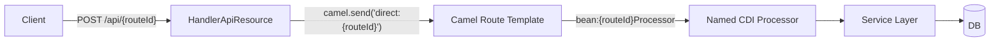
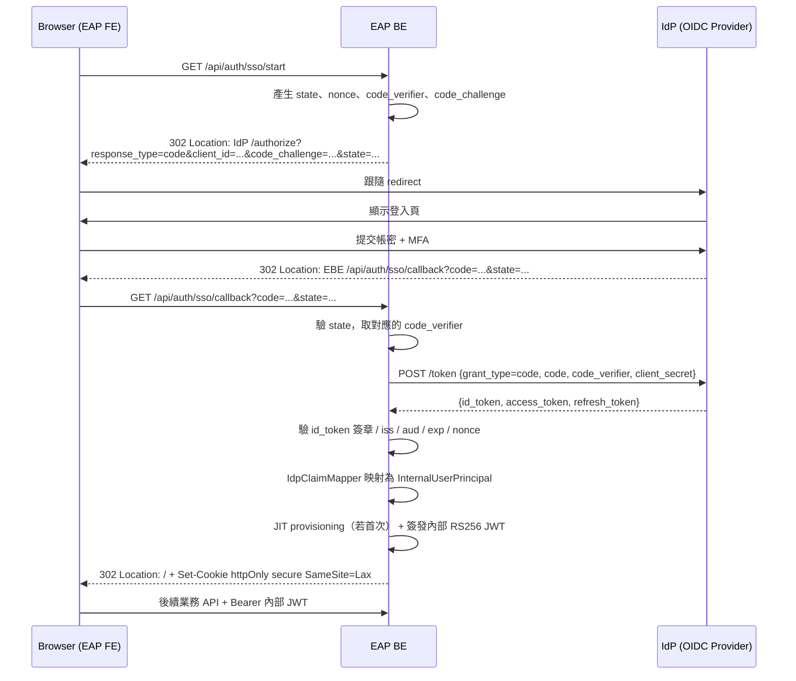
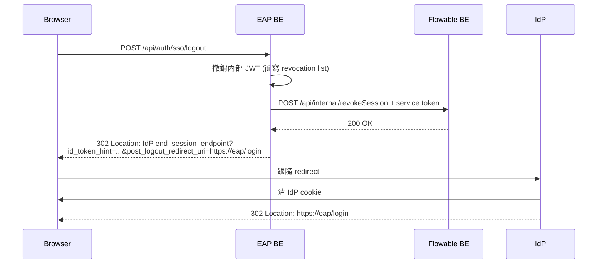

# 類 EAP 後端架構規範

← [返回架構規範總覽](./README.md)

| 項目 | 內容 |
| --- | --- |
| **文件編號** | EAP-ARCH-BE-001 |
| **適用範圍** | 所有「類 EAP 業務系統」之後端專案：以 Quarkus + Apache Camel + Panache 為骨幹、採動態 API 註冊、多 Schema 並存、與 Flowable 工作流程系統整合者 |
| **參考實作** | `/Users/ryan/Coding/Soetek/EAP_Group/eap/backend`（Reference Implementation #1） |
| **參考規範** | `/Users/ryan/Coding/Soetek/project-init.md`（Spring Boot 版，本文件已轉換為 Quarkus） |
| **生效日期** | 2026-04-30 |

---

## 0. 文件定位與閱讀方式

本文件**不是**現況描述文件，而是「**類 EAP 系統的可重用架構規範**」。

- **每章採三段式**：`N.1 規範` / `N.2 現況落差（以當前 EAP 為例）` / `N.3 建議增強（選用）`
- **規範段**：所有未來新建類 EAP 業務系統都應遵守。當前 EAP 視為已部分達成的 Reference Implementation。
- **落差段**：對照當前 EAP backend 程式碼，明確指出**規範說怎樣、程式碼實際怎樣**，附 `file_path:line` 證據。新專案應在第一天即避開這些落差。
- **建議增強段**：**僅在我認為對新專案 ROI 高時才寫**。不適合的（如 Spring Modulith 在 Quarkus 沒有對等機制）就直接捨棄，不硬塞。

> 框架對照（Spring Boot → Quarkus）：`@Service`/`@Component` → `@ApplicationScoped`；`@Repository` → `PanacheRepository`；`@Configuration` → `@Produces` + `@ConfigProperty`；`@Profile` → Quarkus Profile (`%dev.`, `%prod.`)；`@ConditionalOnMissingBean` → `@DefaultBean` / `@Alternative`；Spring Modulith → 無直接對等。

---

## 1. 系統技術骨幹

### 1.1 規範

新建類 EAP 後端**必須**採以下技術棧，避免另起爐灶：

| 類別 | 技術 | 用途 |
| --- | --- | --- |
| Runtime | **Quarkus 3.x** | JVM/Native 雙模式、CDI、開發熱重載 |
| 整合層 | **Apache Camel 4.x** | 動態 API Route、訊息路由、未來整合外部系統的擴展點 |
| ORM | **Hibernate ORM with Panache** | Active Record + Repository 雙模式 |
| DB | **MSSQL Server**（多 Schema） | 業務 schema 與 HRM 系統 schema 並存 |
| Auth | **SmallRye JWT (RS256)** | 無狀態認證；公私鑰於 classpath 或 DB |
| Build | **Maven multi-module** | 父 pom 統一版本管理；每模組獨立 pom |
| Logging | **SLF4J + Logback + MDC traceId** | 結構化日誌 |

### 1.2 現況落差

無重大落差。EAP backend 已採此完整骨幹（見 `/Users/ryan/Coding/Soetek/EAP_Group/eap/backend/pom.xml` 與 `application/src/main/resources/application.properties`）。

### 1.3 建議增強

無。技術棧穩定，不建議變動。

---

## 2. 模組切分（Bounded Context）

### 2.1 規範

- **每個業務模組 = 一個 Maven module = 一個業務界限上下文（Bounded Context）**
- 模組命名以**業務代碼**為主（例：`au013`、`pm001`、`rm002`、`tm`），與 SA 文件編號對齊
- 模組內必有四個套件：`domain` / `processor` / `service` / `util`（後二者選用）
- 每個模組的 `pom.xml` 僅依賴其**真正用到**的其他模組；嚴禁把所有模組都依賴進來
- **`application/` 模組為唯一入口**，集中所有業務模組的依賴與啟動配置
- 模組之間**不得循環依賴**

### 2.2 現況落差

- ✅ EAP 已切分 14 個模組（`au010`~`au014`、`demo`、`otp`、`pm001`、`pm003`、`rm001`~`rm003`、`tm`、`application`），符合上述規範。
- ⚠️ **跨模組直接 `import` Entity**：規範雖未要求 Spring Modulith 等級的模組邊界（Quarkus 無對等機制），但實務上跨模組直接引用 JPA Entity 會在編譯期形成強耦合。

  舉例：
  - `eap/backend/pm001/.../service/PmEmployeeMapper.java` 直接 import `au013`、`rm001`、`rm003` 的 Entity
  - `eap/backend/tm/.../service/TmLeaveCreateService.java` 透過 `@PersistenceUnit("eap") EntityManager` 直接查 `au013.AuOrgUserEntity`、`au011` agents

  影響：`au013` 重構欄位名稱會在編譯期間斷掉 5+ 個下游模組。

### 2.3 建議增強

- **R2-1：每個模組增加 `package-info.java` 描述模組邊界**

  雖然 Quarkus 沒有 Spring Modulith 的執行期檢查，但 `package-info.java` 可作為人類閱讀的契約，並可被未來 ArchUnit 測試引用。

  ```java
  // pm001/src/main/java/org/soetek/eap/pm001/package-info.java
  /**
   * Bounded Context: 員工主檔與合約管理 (PM001)。
   *
   * 對外契約：僅透過 {@link org.soetek.eap.pm001.api.PmEmployeeQueryPort} 暴露。
   * 允許依賴：au013、rm001、demo、foundation。
   * 禁止反向依賴：au014、pm003、rm002、tm。
   */
  package org.soetek.eap.pm001;
  ```

- **R2-2：CI 加入 ArchUnit 測試**自動驗證模組依賴方向，避免人工 Code Review 漏網。

---

## 3. API 入口統一模式（核心模式）

### 3.1 規範

所有業務 API **必須**透過以下單一入口模式註冊：



- **單一 JAX-RS Endpoint**：`@Path("/api") @POST @Path("/{route}")` 為唯一 REST 入口
- **動態註冊**：所有 Processor 為 CDI Bean、`@Named("{routeId}")`、繼承同一 `ApiRouteProcessor` 抽象基類
- **啟動時掃描**：`RouteTemplateRegister` 觀察 `StartupEvent`，依每個 Processor 的 `getTemplateParams()` 為其產生一條 Camel Route
- **嚴禁**在業務模組裡新增 `@Path` 直接寫 JAX-RS Resource，除非是「特殊路徑」（如檔案上傳、SSE）並寫入 architectural exception list

### 3.2 現況落差

- ✅ EAP 已完整實作此模式（見 `application/src/main/java/org/soetek/api/HandlerApiResource.java:75-82`）。所有 14 模組共 100+ Processor 一致遵守。
- ⚠️ **無架構例外清單**：未來如有 SSE 推播、檔案下載等需求時，缺少明確的「准許走非 Camel 路線」的清單與審核機制。

### 3.3 建議增強

- **R3-1：建立 `Docs/architecture-exceptions.md`** 列出所有不走 Camel Route 的端點與其理由，新增需 PR Review。

---

## 4. Processor 規範（業務 API 的最小單位）

### 4.1 規範

每個 API = 一個 Processor。每個 Processor **必須**：

| 元素 | 規範 |
| --- | --- |
| 註解 | `@Slf4j @ApplicationScoped @Named("{routeId}Processor") @RegisterForReflection` |
| 繼承 | 共同抽象 `ApiRouteProcessor` |
| `getTemplateParams()` | 回傳 `routeId`、`apiDescription`、`requiredFields` |
| `process()` | `@ActivateRequestContext`，呼叫 `executeWithErrorHandling()` |
| `processBusinessLogic()` | `@Transactional`（**僅此方法**，不要把交易擴大到整個 `process()`） |
| `@AuditLog` | 標註於 `process()` 方法上，自動記錄操作類型/實體/參數/結果 |
| 回傳 | 透過父類 `buildStandardResponse(traceId, data, operationType)` |

### 4.2 現況落差

- ✅ EAP 對此模式遵守度高。最佳範本：`backend/demo/src/main/java/org/soetek/eap/demo/processor/DemoCreateProcessor.java:67-78`、`backend/tm/.../TmLeaveCreateProcessor.java:72-83`
- ⚠️ **Service 層存在與否不一致**：簡單模組（`au010`、`au011`）將業務邏輯寫在 Processor，複雜模組（`pm001`、`tm`）抽到 Service。**規範未明訂門檻**。

  舉例：
  - `au011` 沒有 `service/` 套件，agent CRUD 全在 Processor（如 `Au011AgentCreateProcessor`）
  - `tm` 有 14 個 Service，每個 Processor 只做參數解析與委派

### 4.3 建議增強

- **R4-1：明訂 Service 抽出門檻**

  > Processor 的 `processBusinessLogic()` 超過 30 行、或包含 2 個以上副作用（DB write、檔案寫入、外部呼叫），**必須**抽到 Service。

  好處：新人能快速判斷該不該抽；Code Review 也有客觀依據。

---

## 5. DTO 與 Request / Response

### 5.1 規範

- API Request / Response **必須**有具名 DTO 類別（記錄式：`record CreateLeaveRequest(...)`），**禁止**直接以 `Map<String, Object>` 作為 API 邊界
- DTO **位於** `{module}/api/request/`、`{module}/api/response/`
- DTO 禁止包含框架註解（`@Entity`、`@Column` 等）；只允許 `@NotNull`、`@Pattern` 等 Bean Validation
- Map ↔ DTO ↔ Domain 的轉換**必須**在 Mapper 中進行；Processor / Service 內禁止寫 `map.get("xxx")` 等手動取值

### 5.2 現況落差

🔴 **嚴重落差**：當前 EAP **完全沒有 DTO 類別**。

- 所有 API payload 以 `Map<String, Object>` 流通（見 `HandlerApiResource.java:75` Camel body 直接是 Map；所有 Processor 的 `processBusinessLogic` 第 2 參數為 `Map<String,Object> payload`）
- 取值散落在 Processor / Service 中：`payload.get("empAccount")`、`payload.get("effectiveDate")` 等 magic key（如 `pm003/.../Pm003WorkflowCallbackProcessor.java:71-75`）
- 即使有「Mapper」類別（如 `pm001/.../util/PmEmployeeMapper.java`），其輸入仍是 Map 而非 DTO

影響：
- 編譯期無型別保護，欄位拼錯只能在 runtime 才發現
- Swagger / OpenAPI 自動產生失準（payload 全是 free-form object）
- 重構欄位名稱必須全文搜尋字串

### 5.3 建議增強

- **R5-1（必做，新專案第一天即實施）**：使用 Java 17 `record` 定義 Request / Response

  ```java
  public record CreateLeaveRequest(
          @NotBlank String empAccount,
          @NotNull LeaveTypeEnum leaveType,
          @NotNull LocalDate startDate,
          @NotNull LocalDate endDate,
          List<AttachmentDto> attachments
  ) {}
  ```

- **R5-2**：`HandlerApiResource` 改為 Generic 入口外，在每個 Processor 內**第一步**用 `objectMapper.convertValue(payload, RequestClass.class)` 轉成型別化 DTO 後再進業務邏輯。已存在的 EAP 可漸進改造，新專案應一開始就採用。

- **R5-3**：採用 **MapStruct** 處理 DTO ↔ Entity 映射，淘汰手寫 Mapper。

---

## 6. 多 Schema 與資料庫

### 6.1 規範

對於需要與既有人事系統（HRM）共存的類 EAP 系統：

- **單一 DB，多 Schema** 是首選方案（避免跨 DB transaction）
- 每個 Schema 對應一個 **Persistence Unit**：
  - Default Persistence Unit → 共用/權限 Schema（如 HRM）
  - Named Persistence Unit（如 `"eap"`）→ 業務 Schema（如 EAP）
- **每個 Persistence Unit 必須有自己的 `AuditableEntity` 基底類別**，避免 Panache「Entity 不可同時屬於多個 PU」的限制
- 所有 Entity 繼承對應 Schema 的基底類，**禁止跨 Schema 繼承**
- **Native SQL 必須帶 Schema 前綴**（例：`SELECT * FROM EAP.DEMO_TABLE`），JPQL 則交給 Hibernate 自動處理

### 6.2 現況落差

- ✅ EAP 完整實作此模式：
  - `application.properties:74-107` 雙 Persistence Unit 設定（HRM + EAP）
  - `foundation.domain.AuditableEntity`（HRM）vs `eap.demo.domain.AuditableEapEntity`（EAP）
  - 所有業務模組 Entity 繼承 `AuditableEapEntity`（見 `tm/.../TmEmpVacationEntity.java:1`）
- ⚠️ **基底類命名與套件位置令人困惑**：`AuditableEapEntity` 放在 `demo` 模組（`eap/backend/demo/src/main/java/org/soetek/eap/demo/domain/`），其他業務模組需依賴 `demo` 模組才能繼承到。

  影響：`demo` 模組變成「事實上的 foundation」，但語意上是「示範模組」。新人會困惑為何刪不掉 demo。

### 6.3 建議增強

- **R6-1**：把 `AuditableEapEntity` 從 `demo` 模組搬到獨立的 `eap-foundation` 模組（或合併進現有 `foundation`）；`demo` 純粹示範。

- **R6-2**：規範文件中明確列出兩個 schema 的所有權矩陣：

  | Schema | 擁有者 | 用途 | Entity 基底類 |
  | --- | --- | --- | --- |
  | HRM | 共用權限系統 | 使用者、角色、權限、審計 | `AuditableEntity` |
  | EAP | 業務系統 | 業務資料 | `AuditableEapEntity` |
  | （新類 EAP 系統） | 自有 | 自有業務 | `Auditable{XXX}Entity` |

---

## 7. 認證、白名單與授權

### 7.1 規範

- **JWT 無狀態認證**：使用 SmallRye JWT，公私鑰**必須**外部化（classpath 或 DB），**嚴禁**寫死於程式碼
- **白名單路徑**透過 `quarkus.http.auth.permission.public.paths` 設定，列出**所有不需 JWT 的 API**（登入、忘記密碼、流程回呼等）
- **授權**採「**前端執行、後端記錄**」雙層模式：
  - 後端在 JWT 驗證通過後，**僅做角色（role）等級的粗粒度防線**
  - **按鈕級權限完全交給前端**（見前端規範第 6 章）
  - 後端透過 `@AuditLog` 完整記錄誰做了什麼，作為後驗追溯
- 流程回呼端點（如 `/api/pm003WorkflowCallback`）**必須**列入白名單**且**附 secret/timestamp 驗證機制（見第 9 章）

### 7.2 現況落差

- ✅ JWT 已實作，金鑰外部化（`application.properties:86-95`，`mp.jwt.verify.publickey.location`）
- ✅ 白名單路徑明確列出（`application.properties:144` 含登入、忘記密碼、`rm003WorkflowCallback`）
- ⚠️ **後端完全無權限檢查**：CLAUDE.md 第 280 行明確說明「權限檢查移至前端」，但這意味著**任何持有有效 JWT 的使用者都能呼叫任何 API**。
- 🔴 **流程回呼端點未額外驗證**：`pm003WorkflowCallback`、`rm003WorkflowCallback` 完全在白名單內、無 secret 驗證。任何人能模擬 Flowable 發起回呼觸發業務副作用（離職、留停、insurance history 寫入等）。

  證據：
  - `pm003/.../Pm003WorkflowCallbackProcessor.java:51-95` 進入後直接呼叫 `callbackService.onProcessCompleted(...)` 寫資料

### 7.3 建議增強

- **R7-1（必做）：流程回呼端點增加 HMAC 簽章驗證**

  Flowable 發起 callback 時帶 `X-Callback-Signature: hmac-sha256(secret, body+timestamp)` header。EAP 收到後重算驗證，並檢查 timestamp 不超過 5 分鐘。secret 兩端共用 ENV 變數。

- **R7-2**：保留**最低限度的後端權限**作為前端被繞過的最後防線

  即使按鈕級權限交前端，後端仍應對「破壞性 API」（刪除、批次操作、跨組織資料查詢）做最低 role 檢查（如 `@RolesAllowed("admin")`）。

---

## 8. SSO 整合（選用）

> 本章為「**新功能規範**」章節：當前 EAP 尚未實作，但本規範為未來啟用 SSO 的類 EAP 系統提供協議無關的設計。額外附 §8.4「實作參考：OIDC Authorization Code + PKCE」作為優先實作建議。

### 8.1 規範

#### 8.1.1 核心原則

- **協議無關抽象**：透過 `IdpAuthenticationPort` 抽象介面接 IdP，OIDC / SAML / CAS 各自實作為 Adapter
- **單一 token 簽發者**：類 EAP 後端**仍由自身簽發 RS256 內部 JWT**；IdP 的 access_token / id_token 在後端內部驗證後即丟棄，**不外流給前端與下游服務**
- **Claim 集中映射**：所有 IdP claim → 內部欄位（`userAccount` / 角色 / 顯示名稱 / email）的映射規則集中於 `IdpClaimMapper`，禁止散落於業務碼
- **Just-in-Time provisioning**：使用者首次 SSO 登入時依 IdP claim 自動建立內部帳號；該事件**必須**寫入 audit log
- **Single Logout（SLO）**：登出**必須**完成三件事：撤自家 JWT、廣播至類 Flowable、重導至 IdP `end_session_endpoint`

#### 8.1.2 `auth.mode` 三種運行模式

`auth.mode` 由 `application.properties` 注入，**規範允許三種值**：

| 模式 | 行為 | 適用情境 |
| --- | --- | --- |
| `local` | 純本地帳密，走 `/api/auLogin`；SSO 邏輯不啟用 | 內網單機 / 開發 / 不依賴企業 IdP |
| `sso` | 所有使用者必走 IdP；`/api/auLogin` 啟動時即拒絕請求 | 企業全員 SSO，廢止本地帳號 |
| `hybrid` | SSO + 本地帳密並存；前端登入頁顯示兩種選項 | 員工走 SSO，外部使用者（廠商、客戶）走本地帳號 |

**強制規定**：
- `auth.mode` **不可硬編碼**於程式碼，必須由 ENV 注入
- IdP 配置（`client_id`、`client_secret`、`issuer_url`、`redirect_uri`）**必須**從 vault / k8s secret 注入，**禁止** commit 至 git
- IdP 不可用時：
  - `auth.mode=sso` 啟動時 **fail fast**（不可降級成無認證）
  - `auth.mode=hybrid` 啟動時自動退回 `local`，並產生 warn log
- IdP 整合**必須**經 `IdpAuthenticationPort`，業務模組**禁止**直接呼叫 OIDC / SAML SDK
- 內部 JWT 仍維持 RS256 + 共用 KeyPair（與 [§7](#7-認證白名單與授權) 一致），這樣類 Flowable 端 [整合規範 §3.3](./eap-flowable-integration.md#33-建議增強) 不需任何變更

#### 8.1.3 SSO 啟用後的端點規範

| 端點 | 用途 | 白名單 | 啟用條件 |
| --- | --- | --- | --- |
| `GET /api/auth/sso/start` | 產生 state / nonce / PKCE 並重導 IdP | ✓ 公開 | `auth.mode != local` |
| `GET /api/auth/sso/callback` | 接 IdP `code` + 換 token + 驗證 + 簽內部 JWT | ✓ 公開 | `auth.mode != local` |
| `POST /api/auth/sso/logout` | SLO：撤 JWT、廣播 Flowable、重導 IdP 登出 | 已登入 | `auth.mode != local` |
| `POST /api/auLogin` | 本地帳密 | ✓ 公開 | `auth.mode != sso` |

### 8.2 現況落差

當前 EAP **尚未實作 SSO**。所有登入走本地 `/api/auLogin`，等同隱含 `auth.mode=local`。

- ✅ 已具備 RS256 JWT 簽發機制（`SmallRye JWT`），SSO 接入後可直接重用
- ✅ 已有 `userPermissionQuery` API 處理角色 → 頁面權限矩陣，IdP claim → 內部角色映射可承襲此設計
- 🟡 **無 `IdpAuthenticationPort` 抽象**：新類 EAP 系統若立即啟用 SSO 需從零設計
- 🟡 **`application.properties` 無 `auth.mode` 切換配置**
- 🟡 **無 IdP 配置佔位符** 於 application.properties（若後續啟用需補上）

> 嚴重性整體偏低（`local` 模式對單系統而言是合法選擇）。但若新類 EAP 系統一開始就要對接企業 IdP，建議直接採用 §8.3 的設計，避免 retrofit。

### 8.3 建議增強

- **R8-1（啟用 SSO 時必做）：建立 `IdpAuthenticationPort` 抽象**

  ```java
  // domain/port/IdpAuthenticationPort.java
  public interface IdpAuthenticationPort {
      AuthorizationRequest buildAuthorizationRequest(String state, String nonce);
      IdpUserInfo verifyAndExtract(String authorizationCode, String codeVerifier);
      LogoutRequest buildLogoutRequest(String idTokenHint, String postLogoutRedirectUri);
  }

  // infrastructure/adapter/real/OidcIdpAdapter.java       ← OIDC 實作
  // infrastructure/adapter/real/SamlIdpAdapter.java       ← 預留（未來）
  // infrastructure/adapter/null/NullIdpAdapter.java       ← auth.mode=local 時生效
  ```

  Quarkus 透過 `@LookupIfProperty(name="auth.mode", stringValue="sso")` 等條件選擇 Adapter。

- **R8-2：`IdpClaimMapper` 集中映射**

  ```java
  public interface IdpClaimMapper {
      InternalUserPrincipal map(IdpUserInfo idpUserInfo);
  }
  ```

  IdP 換代、新增 IdP（多租戶場景）只需新增 Mapper 實作，**業務碼零變更**。

- **R8-3：`auth.mode` 切換以 CDI Bean Lookup 實現**

  ```java
  @ApplicationScoped
  @LookupIfProperty(name = "auth.mode", stringValue = "sso")
  public class SsoOnlyLoginGuard implements LoginGuard { ... }

  @ApplicationScoped
  @LookupUnlessProperty(name = "auth.mode", stringValue = "sso")
  public class LocalLoginGuard implements LoginGuard { ... }
  ```

  避免 `if (mode.equals("sso"))` 散落於各 Processor。

- **R8-4：JIT provisioning 必寫 audit**

  使用者首次經 SSO 登入觸發內部帳號建立時：
  - audit event：`USER_PROVISIONED_VIA_SSO`
  - 內容：IdP `sub`、`preferred_username`、`groups`、初始角色映射結果
  - 用途：後續稽核「這個帳號哪來的」、追溯映射規則演進

- **R8-5：Single Logout 廣播**

  類 EAP 後端 `/api/auth/sso/logout` 必須執行：
  1. 撤銷內部 JWT（寫入 `jwt_revocation_list`，搭配 [整合規範 R3-2](./eap-flowable-integration.md#33-建議增強)）
  2. POST 至類 Flowable `/api/internal/revokeSession`（service token）
  3. 回應 302 至 IdP `end_session_endpoint`，帶 `id_token_hint` 與 `post_logout_redirect_uri`

  缺少任一步驟都會造成「使用者以為登出，但 token 仍能用」。

### 8.4 實作參考：OIDC Authorization Code + PKCE

**首選協議**：OIDC（OpenID Connect）+ PKCE。理由：
- 現代 Web 標準，IdP 普遍支援（Azure AD、Keycloak、Okta、Auth0、Google Workspace）
- 比純 OAuth 2.0 多 ID Token，可離線驗證身份不必再打 `userinfo`
- PKCE 防 authorization code 攔截攻擊（適用於不能安全存放 client_secret 的情境）
- Quarkus 原生支援（`quarkus-oidc` extension）

#### 8.4.1 登入流程序列



#### 8.4.2 Quarkus 設定範例

```properties
# auth.mode 切換（local / sso / hybrid）
auth.mode=${AUTH_MODE:hybrid}

# OIDC（quarkus-oidc extension）
quarkus.oidc.enabled=true
quarkus.oidc.auth-server-url=${SSO_IDP_ISSUER_URL}
quarkus.oidc.client-id=${SSO_CLIENT_ID}
quarkus.oidc.credentials.secret=${SSO_CLIENT_SECRET}
quarkus.oidc.application-type=web-app
quarkus.oidc.authentication.scopes=openid,profile,email,groups
quarkus.oidc.authentication.pkce-required=true
quarkus.oidc.authentication.cookie-path=/
quarkus.oidc.authentication.redirect-path=/api/auth/sso/callback
quarkus.oidc.logout.path=/api/auth/sso/logout
quarkus.oidc.logout.post-logout-path=/login
quarkus.oidc.token.issuer=${SSO_IDP_ISSUER_URL}

# 內部 JWT（與 §7 一致，不變）
mp.jwt.verify.issuer=soetek
smallrye.jwt.new-token.issuer=soetek

# Claim 映射（自訂 property，由 IdpClaimMapper 讀）
sso.claim.user-account=preferred_username
sso.claim.display-name=name
sso.claim.email=email
sso.claim.groups=groups
```

#### 8.4.3 Claim 映射對照

| OIDC Claim | 內部欄位 | 備註 |
| --- | --- | --- |
| `sub` | `externalId`（備援） | IdP 全域唯一 ID，僅當 `preferred_username` 缺失時才用 |
| `preferred_username` | `userAccount` | 主要識別欄位 |
| `name` | `dispName` | 顯示名稱 |
| `email` | `email` | 通知 / audit |
| `groups` | 內部 `roles[]` | 透過 `IdpClaimMapper.mapGroupsToRoles()` 轉換；對應規則由 DB 配置驅動 |
| `iat` / `exp` | （丟棄） | 不延伸至內部 JWT；內部 JWT 自有 ttl |

#### 8.4.4 Single Logout 流程



#### 8.4.5 安全要點

- `state` / `nonce` 用 cryptographically secure RNG（`SecureRandom`），存於**後端 session 或加密 cookie**，**不可放明文 cookie**
- ID Token 驗證 5 項：**簽章**（用 IdP JWKS）、`iss`、`aud`、`exp`、`nonce`，缺一不可
- 內部 JWT 與 IdP access_token / refresh_token **完全隔離**：前端**只看見內部 JWT**
- PKCE `code_verifier` 至少 43 字元、僅由 `[A-Z][a-z][0-9]-._~` 組成
- 對 `redirect_uri` 在 IdP 端做 exact match white-list，避免 open redirect
- IdP 故障時：
  - `auth.mode=sso`：啟動時 fail fast，不允許無認證
  - `auth.mode=hybrid`：自動退回 `local`，啟動 log warn，運維告警
- **絕不**把 access_token 寫入 localStorage 或 query string

---

## 9. 與 Flowable 的整合

詳見另一份文件 [`eap-flowable-integration.md`](./eap-flowable-integration.md)。本節僅列出後端側的核心規範。

### 9.1 規範

- **流程啟動由前端負責**（`flowable-orchestration` 規範）。EAP 後端 Service 在「建立業務文件」場景**不主動呼叫** Flowable startProcess
- EAP 後端**僅在以下情境**呼叫 Flowable 後端：
  1. 查詢類（即時的目前處理人、目前任務狀態）
  2. 主管 Override 類（強制終止、轉派）
- Flowable → EAP 走 **callback 模式**：流程完成事件透過 EAP 暴露的白名單 API 寫入業務資料（離職正式生效、insurance history 等）
- 所有對 Flowable 的 outbound HTTP **必須** timeout（建議 3 秒）並在失敗時降級而非拋例外

### 9.2 現況落差

- ✅ 大部分 Service 遵守 `flowable-orchestration`（見 `rm002/.../RmCreateInternDocService.java:24` 註解：「依 flowable-orchestration 規範，此 Service 不呼叫 Flowable」）
- ✅ Outbound 呼叫有 timeout 與降級（`rm003/.../Rm003PersonRequestService.java:185, 215-218` 失敗時回傳空 Map）
- ⚠️ Outbound 呼叫的 Endpoint 只有一處（`/api/getTaskCurrentHandlers`）；未來增加新呼叫時容易又散落各處
- ⚠️ Flowable base URL 配置硬編碼於 `application.properties:306`（`http://192.168.170.91:3600`）；無 Profile 切分（dev/test/prod）

### 9.3 建議增強

- **R9-1：建立 `FlowableClientPort` Domain 介面 + `FlowableHttpAdapter` 實作**

  集中所有對 Flowable 的呼叫，避免散落各 Service。

  ```java
  // domain/port/
  public interface FlowableClientPort {
      Map<String, String> getTaskCurrentHandlers(List<String> procInstIds);
      // 未來新增的 outbound 都集中於此
  }

  // infrastructure/adapter/real/
  @ApplicationScoped
  public class FlowableHttpAdapter implements FlowableClientPort { ... }

  // infrastructure/adapter/null/
  @ApplicationScoped @DefaultBean
  public class NullFlowableAdapter implements FlowableClientPort {
      public Map<String, String> getTaskCurrentHandlers(List<String> ids) {
          return Collections.emptyMap(); // 靜默降級
      }
  }
  ```

  好處：
  - Flowable 不在線時系統仍可啟動（Quarkus 自動回退到 Null Adapter）
  - 整合測試可換成 Mock Adapter
  - 未來換 BPMN 引擎僅改一處

  此為 project-init.md 中 Hexagonal / Null Adapter 規範的**精準應用點**——只在「真正會跨網路呼叫的外部依賴」上實施，不全面套用導致過度抽象。

---

## 10. 例外處理與錯誤回應

### 10.1 規範

- **API 邊界統一例外**：透過 `@ServerExceptionMapper` 將所有未捕獲例外轉成標準錯誤 response
- **業務例外類別化**：`BusinessException(code, httpStatus, message)`，code 採命名常數（如 `ErrorCode.LEAVE_DATE_OVERLAP`）
- **Processor / Service 內**禁止 `try { ... } catch (Exception e) { return null; }` 式的吞例外。允許 catch 的場景：
  1. 對外 HTTP 呼叫的降級回退（如 R9-1 範例）
  2. 已記錄並重新包裝為 `BusinessException` 的 wrap
- 所有 catch 區塊**必須**有 `log.warn` 或 `log.error` 並帶上 `traceId`

### 10.2 現況落差

- ✅ `BusinessException` 模式已建立（見各 Processor 中拋例外處）
- ✅ Outbound HTTP 降級實作正確（`Rm003PersonRequestService:215-218`）
- ⚠️ **Error Code 字串散落**：`Pm003WorkflowCallbackProcessor.java:84` 直接寫死 `"VALIDATION_ERROR"` 字串；其他 Processor 也有類似情況
- ⚠️ **無集中的 ErrorCode Enum 或 Constants**

### 10.3 建議增強

- **R10-1**：建立 `common/domain/error/ErrorCode.java` Enum 或 `ErrorCodeConstants` final class，集中管理所有 error code，避免「`VALIDATION_ERR`」「`VALIDATION_ERROR`」這種拼寫不一致問題。

  EAP 已有 `Docs/ERROR_CODE_USAGE_EXAMPLES.md`，但程式碼尚未完全對齊。

---

## 11. AOP 與橫切關注點

### 11.1 規範

- **錯誤 Log**、**執行計時**、**呼叫計次**、**Audit Log** 一律透過 AOP（CDI Interceptor）處理
- AOP 實作**必須**位於 `common/infrastructure/interceptor/`，不可分散
- AOP 內部**嚴禁**包含業務邏輯
- 切面綁定方式：自訂 `@Auditable`、`@Timed`、`@Counted` annotation

### 11.2 現況落差

- ✅ `@AuditLog` 已實作為 CDI Interceptor 模式（推測位於 foundation 模組，已被廣泛使用）
- ⚠️ **缺少 `@Timed` / `@Counted`**：無 Service 級別的執行時間統計、無 Metrics 整合
- ⚠️ **錯誤 Log 仍散落**：很多 catch 區塊內手動 `log.error(...)`，未統一由 AOP 處理

### 11.3 建議增強

- **R11-1**：整合 **Micrometer**（Quarkus 原生支援）+ 自訂 `@Timed` Interceptor，自動為所有 Service 方法產生 P50/P95 latency 指標。

- **R11-2**：建立 `ErrorLoggingInterceptor`，自動 log 所有未捕獲例外與 `traceId`，業務碼內不必手動 `log.error`。

---

## 12. 設定外部化與 No Hardcoding

### 12.1 規範

- 所有環境相關值（DB URL、外部 API URL、檔案路徑、JWT 金鑰位置）**必須**透過 `@ConfigProperty` 注入
- **必須**提供 `defaultValue`，使應用在缺乏 ENV 變數時仍能啟動於 dev mode
- 字串常數（API path、JWT claim key、cache key prefix）**必須**集中於 `common/domain/constants/` 下的 final class
- 有限選項（status、type、role）**必須**為 Enum，禁止裸字串
- 數值常數優先用 `BigDecimal.ZERO`、`Collections.emptyList()` 等 JDK 內建；自建放於對應 Constants

### 12.2 現況落差

- ✅ 環境變數外部化做得好（見 `application.properties` 中 DB / Redis / file path 都有 `${ENV:default}` 形式）
- ⚠️ **DateTimeFormatter 重複定義**：相同 pattern `"yyyy-MM-dd"` 在 6+ 模組裡各自寫了 `DateTimeFormatter` 常數
- ⚠️ **Schema 前綴硬編碼**：YAML SQL 中 `EAP.DEMO_TABLE` 直接寫死，未抽出常數
- ⚠️ **AuditLog 中 Entity 名稱硬編碼**：`@AuditLog(entityName = "Demo")` 字串散落（`DemoCreateProcessor` 等）

### 12.3 建議增強

- **R12-1**：建立 `common/domain/constants/DateFormatConstants.java` 集中所有日期格式
- **R12-2**：每個模組建立 `{Module}Constants.java`，AuditLog 的 entityName 從常數取
- **R12-3**：Schema 名稱抽出為 `application.properties` 中 property `app.schema.eap=EAP`，YAML SQL 透過 placeholder 注入

---

## 13. 目錄結構參考

```text
backend/
├── pom.xml                              # 父 pom，集中版本
├── application/                         # 唯一啟動模組
│   ├── pom.xml                          # 依賴所有業務模組
│   └── src/main/
│       ├── java/{group}/api/
│       │   └── HandlerApiResource.java  # 唯一 JAX-RS 入口
│       └── resources/
│           └── application.properties
│
├── common/                              # 跨模組共用（建議獨立）
│   ├── domain/
│   │   ├── constants/                   # ApiPathConstants、ErrorCode、DateFormatConstants
│   │   ├── enums/
│   │   └── error/
│   └── infrastructure/
│       └── interceptor/                 # AOP：@AuditLog、@Timed、@ErrorLogging
│
├── foundation/                          # 共用 schema 基底（HRM-side）
│   └── domain/AuditableEntity.java
│
├── eap-foundation/                      # 業務 schema 基底（EAP-side）— 建議獨立，不混入 demo
│   └── domain/AuditableEapEntity.java
│
└── {module}/                            # 業務模組（au013、pm001、tm 等）
    └── src/main/java/{group}/{module}/
        ├── package-info.java            # 模組契約宣告（R2-1）
        ├── api/
        │   ├── request/                 # Request DTO（R5-1）
        │   ├── response/                # Response DTO
        │   └── mapper/                  # API ↔ Application 映射（MapStruct）
        ├── application/
        │   ├── usecase/                 # = 目前的 service/，重新命名以對齊 Clean Arch
        │   └── dto/
        ├── domain/
        │   ├── model/                   # Aggregate Root、Value Object
        │   ├── port/                    # Outbound Port（如 FlowableClientPort）
        │   ├── enums/
        │   └── constants/
        ├── infrastructure/
        │   ├── adapter/
        │   │   ├── real/                # 真實 Adapter（HTTP、Cache）
        │   │   └── null/                # Null Adapter（降級）
        │   ├── repository/              # Panache Repository
        │   ├── entity/                  # JPA Entity（區分於 Domain Model）
        │   └── mapper/                  # Domain ↔ Entity 映射
        └── processor/                   # Camel Processor（API 入口）
```

---

## 14. 開發 Checklist

新增模組或功能時，逐項確認：

### 14.1 模組層級

- [ ] 每個模組有 `package-info.java`
- [ ] `pom.xml` 僅依賴真正用到的模組
- [ ] 無循環依賴
- [ ] `application/pom.xml` 已加入此模組

### 14.2 API 層

- [ ] Processor 繼承 `ApiRouteProcessor`
- [ ] `@Slf4j @ApplicationScoped @Named @RegisterForReflection` 完整
- [ ] `getTemplateParams()` 包含 `routeId`、`apiDescription`、`requiredFields`
- [ ] `process()` 使用 `@ActivateRequestContext`
- [ ] `processBusinessLogic()` 使用 `@Transactional`
- [ ] `@AuditLog` 標註完整
- [ ] **Request / Response 為具名 DTO，非 `Map<String, Object>`**（R5-1）

### 14.3 業務邏輯

- [ ] 超過 30 行或含 2+ 副作用 → 抽到 Service / UseCase
- [ ] 跨模組查詢透過 Port 而非直接 import 其他模組 Entity
- [ ] 對 Flowable 的呼叫**必須**經 `FlowableClientPort`（R9-1）

### 14.4 Schema 與 Entity

- [ ] Entity 繼承對應 Schema 的基底類
- [ ] 不跨 PU 繼承
- [ ] Native SQL 帶 Schema 前綴（或透過 placeholder）

### 14.5 例外與錯誤

- [ ] 業務例外用 `BusinessException` + `ErrorCode` Enum
- [ ] catch 區塊**必須**有 log + traceId
- [ ] 對外 HTTP 呼叫**必須**有 timeout 與降級

### 14.6 No Hardcoding

- [ ] Magic string 改用 Constants
- [ ] 有限選項用 Enum
- [ ] DateTimeFormatter 集中於 `DateFormatConstants`
- [ ] Schema 名稱由 property 注入

### 14.7 安全

- [ ] 流程 callback 端點驗 HMAC 簽章（R7-1）
- [ ] 破壞性 API 加 `@RolesAllowed`（R7-2）

### 14.8 SSO（僅當 `auth.mode != local`）

- [ ] `auth.mode` 由 ENV 注入，未硬編碼
- [ ] IdP 整合經 `IdpAuthenticationPort`，業務模組未直呼 OIDC / SAML SDK（R8-1）
- [ ] `IdpClaimMapper` 集中所有 claim → 內部欄位映射規則（R8-2）
- [ ] `auth.mode=sso` 啟動時 IdP 不可用即 fail fast；`hybrid` 自動退回 local
- [ ] PKCE 啟用、`state` / `nonce` 由後端產生並驗證
- [ ] ID Token 5 項驗證齊全（簽章 / iss / aud / exp / nonce）
- [ ] JIT provisioning 寫入 audit log（R8-4）
- [ ] Single Logout 三步完成：撤 JWT + 通知 Flowable + 重導 IdP `end_session_endpoint`（R8-5）
- [ ] IdP secret 由 vault / k8s secret 注入，未 commit 至 git
- [ ] 前端僅持有內部 JWT，未洩漏 IdP access_token

---

## 15. 變更歷程

| 版本 | 日期 | 變更摘要 | 變更者 |
| --- | --- | --- | --- |
| 1.0.0 | 2026-04-30 | 初版發佈，自當前 EAP backend 歸納而成，定位為類 EAP 系統的可重用樣板 | 架構整理 |
| 1.1.0 | 2026-04-30 | 新增 §8 SSO 整合（選用）章節，含 OIDC + PKCE 實作參考；原 §8~§14 順移為 §9~§15；§14 Checklist 補 §14.8 SSO 子段 | 架構整理 |

---

← [返回架構規範總覽](./README.md)
