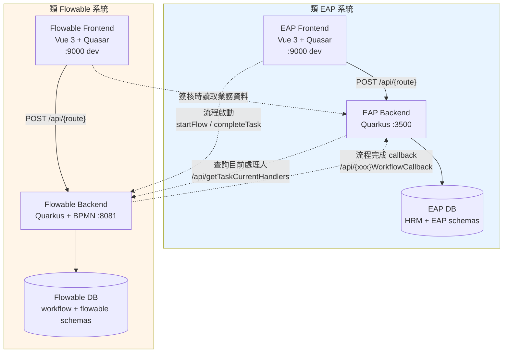
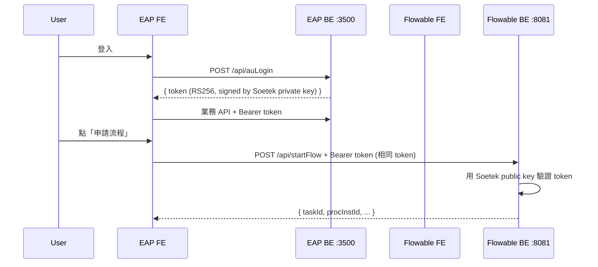
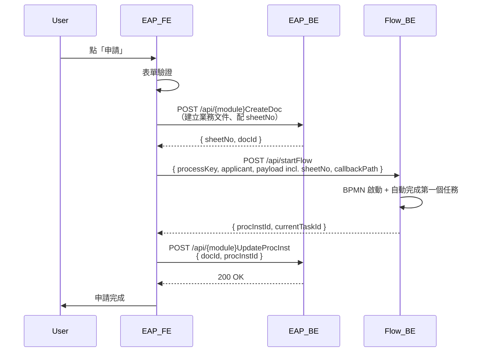

# 類 EAP × 類 Flowable 整合架構規範

← [返回架構規範總覽](./README.md)

| 項目 | 內容 |
| --- | --- |
| **文件編號** | EAP-FLOW-INT-001 |
| **適用範圍** | 類 EAP 業務系統與類 Flowable 工作流系統的整合契約：認證鏈路、流程啟動、回呼機制、查詢協作、附件交換 |
| **參考實作** | EAP backend / frontend × Flowable backend / frontend（位於 `EAP_Group/eap` 與 `flowable/` ） |
| **相關文件** | [eap-backend.md](./eap-backend.md)、[eap-frontend.md](./eap-frontend.md)、[flowable-backend.md](./flowable-backend.md)、[flowable-frontend.md](./flowable-frontend.md) |
| **生效日期** | 2026-04-30 |

---

## 0. 文件定位

當未來新增「**類 EAP 業務系統**」需要與既有「**類 Flowable 工作流引擎**」整合時，本文件為**整合契約規範**。三段式：`規範` / `現況落差` / `建議增強`。

**核心立場**：兩端**完全解耦**，透過明確的 HTTP 契約溝通。整合面是兩個系統的**公開 API**，必須穩定、可版本化、可灰度。

---

## 1. 整體拓樸與部署模型

### 1.1 規範



**規範要點**：
- **兩個 Backend 完全獨立**部署，各有自己的 DB
- **port 分離**：類 EAP backend = `3500`，類 Flowable backend = `8081`（dev 環境）
- **port 必須**透過 `quarkus.http.port` 設定，**禁止**在程式碼裡寫死
- **兩個 Frontend 各自有 baseURL**，透過 `VITE_GLOB_API_URL` 環境變數注入
- 整合**只發生在 4 條 HTTP 路徑上**（見第 2 章），其餘**全部禁止**

### 1.2 現況落差

- ✅ 部署拓樸符合規範
- 🟡 **EAP CLAUDE.md 標 port 為 8081，實際為 3500**（`EAP_Group/eap/backend/application/.../application.properties:4`）。文件過時，會誤導新人。
- 🟡 **EAP frontend axios.ts 預設 baseURL 為 `http://localhost:8081/api`**（`EAP_Group/eap/frontend/src/boot/axios.ts:348`），但 EAP backend 實際是 3500。雖然 ENV 變數會優先，預設值仍誤導。

### 1.3 建議增強

- **R1-1（必做）**：更新 EAP CLAUDE.md 與 axios.ts 預設 baseURL 為 3500，並在文件首段宣告 port 對照表。

---

## 2. 整合接觸面（Touchpoints）— 唯一允許的四條路徑

### 2.1 規範

僅以下四條 HTTP 整合路徑為**規範允許**，所有其他跨系統呼叫**禁止**：

| # | 方向 | 觸發者 | 用途 | 端點 | 認證 |
| --- | --- | --- | --- | --- | --- |
| **A** | EAP Frontend → Flowable Backend | 使用者操作 | 流程啟動、查詢、簽核、完成 | `POST {flowable}/api/{route}` | JWT（與 EAP 共用簽發/驗證） |
| **B** | Flowable Frontend → EAP Backend | 簽核者讀取業務資料 | 顯示申請人完整資料 | `POST {eap}/api/{route}` | JWT |
| **C** | Flowable Backend → EAP Backend | 流程完成 PROCESS_COMPLETED | 通知業務系統做最終生效（離職、轉正、insurance 寫入等） | `POST {eap}/api/{xxx}WorkflowCallback` | HMAC 簽章（白名單免 JWT） |
| **D** | EAP Backend → Flowable Backend | 業務查詢需要即時流程狀態 | 查目前處理人、目前任務、流程歷程 | `POST {flowable}/api/getTaskCurrentHandlers` 等 | JWT 或 service token |

**核心約束**：
- 路徑 A、B 是**前端發起**的整合，後端不主動觸發
- 路徑 C 是**Flowable 觸發 EAP**，**唯一**正確的「流程結束 → 業務生效」管道
- 路徑 D 是**EAP 觸發 Flowable**，僅限**只讀查詢**，**禁止**用於啟動流程或完成任務（那是路徑 A 的職責）

**禁止事項**：
- ❌ EAP 後端 Service 直接呼叫 Flowable 啟動流程（違反 `flowable-orchestration` 規範）
- ❌ Flowable BPMN Script Task 直接 `HttpClient` 打 EAP（必須走路徑 C 的 callback registry）
- ❌ EAP 後端與 Flowable 後端共享 DB connection / 直連對方 schema
- ❌ 兩端透過 message queue / Redis pub-sub 通訊（除非未來明確擴充規範）

### 2.2 現況落差

- ✅ 路徑 A：類 EAP 前端可直接打類 Flowable 後端（FE 已內建 startFlowApi）
- ✅ 路徑 C：完整實作於 `flowable/backend/core/.../service/WorkflowService.java:1683-1727`
- ✅ 路徑 D：實作於 `EAP_Group/eap/backend/rm003/.../service/Rm003PersonRequestService.java:172-219`
- ✅ EAP Service 大多遵守 `flowable-orchestration` 規範（見 `eap/backend/rm002/.../RmCreateInternDocService.java:24` 註解）
- 🟡 **路徑 B 機制不明**：簽核者在 Flowable 前端看到的「申請人完整資料」目前是從 Flowable process variable 取得（form 物件），還是真的會跨系統打 EAP backend，未明確記錄
- 🟡 **路徑 C 有「雙軌並存」風險**：`CALLBACK_PATH_MAP` 只登記 `PersonRequest`，但 EAP 端有 `pm003WorkflowCallbackProcessor`（離職/留停回呼）。表示 pm003 的回呼是透過 BPMN Script Task 或其他繞過 registry 的方式觸發。**這違反規範第 2 章的禁止事項**。

### 2.3 建議增強

- **R2-1（必做）**：盤點所有 BPMN 中的 Script Task，凡有 `HttpClient` / 跨系統呼叫的，**遷移到 `CALLBACK_PATH_MAP`**。
- **R2-2**：明文規範路徑 B：建議簽核者在 Flowable 前端「點開申請人卡片」時，**經類 Flowable 後端代理**轉打類 EAP，避免前端直接跨域。

---

## 3. 認證鏈路與 Token 共享

> **SSO 啟用情境**：當類 EAP 啟用 SSO（見 [`eap-backend.md` §8](./eap-backend.md#8-sso-整合選用)），類 Flowable **仍以接受類 EAP 簽發的內部 RS256 JWT 為原則**——不直接對接 IdP、不參與 OIDC redirect、不持有 IdP credentials。整個 SSO 對類 Flowable 是**透明的**。理由：避免雙頭 IdP 配置維護；維持「單一 token 簽發者」設計；類 Flowable 對使用者而言是後台服務，不應主動觸發瀏覽器重導。

### 3.1 規範

兩個系統採**單一 JWT 簽發者**，使用者只需登入一次即可在兩個系統互通：



**規範要點**：
- **單一 KeyPair**：私鑰僅 EAP backend 持有（用於簽發），公鑰兩端皆有（用於驗證）
- **單一 issuer claim**：兩端 JWT 的 `iss` 統一為 `soetek`
- **roles claim** 兩端共用語意（`admin` / `user` 等）
- **session 綁定**：類 Flowable 後端的 `UserSessionEntity` 必須能識別並接受由類 EAP 簽發的 token
- 使用者登出時，類 EAP 後端**必須**廣播登出事件給類 Flowable 後端（或共用 session table 即時失效）

### 3.2 現況落差

- ✅ 兩端 JWT issuer 相同（`mp.jwt.verify.issuer=soetek` 在兩個 application.properties 都有）
- ✅ 兩端公鑰位置可指向同一個來源
- 🟡 **session 不共用**：類 EAP 與類 Flowable 各有自己的 `UserSessionEntity` table，登出無法即時生效於對方
- 🟡 **roles 不一致風險**：類 EAP roles 來自人事系統的角色表，類 Flowable roles 來自自己的 `auRoles` 表，可能漂移
- 🔴 **類 Flowable 後端白名單把太多 API 設為公開**（見類 Flowable 後端規範第 7 章），實際上**很多核心 API 不驗 JWT**。這讓「跨系統 token 流通」的價值被削弱。

### 3.3 建議增強

- **R3-1（必做）**：縮減類 Flowable 後端白名單為「真正不需登入的端點」（健康檢查、登入、註冊），其餘**全部**需 JWT。
- **R3-2**：建立**共用 Session Service**或**revocation list**（Redis 中存 blacklisted JWT jti），讓登出能即時跨兩端生效。
- **R3-3**：建立**單一 Role Source of Truth**（建議在類 EAP 端，類 Flowable 同步），避免雙端漂移。

---

## 4. 路徑 C — 流程完成回呼契約（最關鍵）

### 4.1 規範

當 Flowable 流程完成時，自動通知類 EAP 寫業務生效資料。這是**整合的核心管道**。

#### 4.1.1 派發機制

- **觸發點**：`WorkflowEventListener` 監聽 `PROCESS_COMPLETED` 事件
- **登錄表**：類 Flowable 後端的 `CALLBACK_PATH_MAP`（或設定檔）登記 `processDefinitionKey → callbackPath` 對照
- **完整 URL**：`{eap.api.base-url}{callbackPath}`，`eap.api.base-url` 由設定檔注入
- **HTTP 方法與格式**：`POST` + `Content-Type: application/json`
- **Timeout**：3 秒（可調），失敗**不阻擋**流程結束，僅記 log

#### 4.1.2 Payload 契約

**最低必備欄位**：

```json
{
  "procInstId": "string",        // Flowable 流程實例 ID（必填）
  "sheetNo": "string",           // 業務表單編號（必填，由 EAP 端起單時生成）
  "processDefinitionKey": "string"  // 建議加上，便於 EAP 端路由
}
```

**規範要點**：
- **payload 保持最小**：不塞流程變數細節。EAP 端如需更多資料，**必須**用 `procInstId` 反查 Flowable
- **JSON 序列化必須用 `ObjectMapper`**，禁止字串拼接
- **欄位命名統一 camelCase**（與兩端 API 風格一致）

#### 4.1.3 安全機制（HMAC）

```http
POST /api/pm003WorkflowCallback HTTP/1.1
Content-Type: application/json
X-Callback-Timestamp: 1735632000000
X-Callback-Signature: sha256=abcd1234...

{"procInstId":"...","sheetNo":"...","processDefinitionKey":"..."}
```

- `X-Callback-Signature = HMAC-SHA256(secret, body + timestamp)`
- secret 為兩端共用的 ENV 變數（`CALLBACK_HMAC_SECRET`），**禁止**寫入程式碼或設定檔倉庫
- 類 EAP 端在 callback Processor 第一步驗證簽章；timestamp 過期（>5 分鐘）拒絕

#### 4.1.4 冪等性要求

- 類 EAP 端 callback handler **必須**冪等：同 `procInstId` 重送結果一致
- 實作建議：以 `procInstId + sheetNo` 為 idempotency key，第一次處理寫入 `eap_workflow_callback_history` 表，後續重送讀此表後直接回 200
- 類 Flowable 端**不重試**（規範要求 EAP 端冪等已足夠；引入 retry 會放大重複負載）

#### 4.1.5 EAP 端 callback API 規範

- 路徑命名：`/api/{moduleAbbr}{ProcessKey}WorkflowCallback`（例：`/api/rm003WorkflowCallback`、`/api/pm003WorkflowCallback`）
- **必須**列入 EAP 後端白名單（免 JWT），但**必須**驗 HMAC
- 必須回 200 + 標準 response wrapper

### 4.2 現況落差

- ✅ 派發機制與 callback registry 已實作（`flowable/backend/core/.../service/WorkflowService.java:1660-1727`）
- ✅ Timeout 與失敗降級正確
- 🔴 **HMAC 簽章未實作**：當前 callback 為純 JSON，**任何能 reach 到 EAP backend 3500 port 的人都能偽造 callback 觸發離職寫入**。安全性嚴重不足。
- 🔴 **payload 用字串拼接**：`String.format("{\"procInstId\":\"%s\",\"sheetNo\":\"%s\"}")` (`WorkflowService.java:1703`)，特殊字元有 JSON 注入風險
- 🟡 **payload 不含 `processDefinitionKey`**：EAP 端只能依路徑判斷流程類型，缺少明確的識別欄位
- 🟡 **冪等性未驗證**：EAP 端 `Pm003WorkflowCallbackProcessor` 與 `Pm003CallbackService.onProcessCompleted()` 未檢查重送
- 🟡 **`pm003WorkflowCallback` 不在 `CALLBACK_PATH_MAP`** 內，表示其觸發路徑繞過 registry（推測為 BPMN Script Task）

  證據：`flowable/backend/core/.../service/WorkflowService.java:1665-1669` 中 Map 只有 `"PersonRequest"`，但 EAP 有對應的 `pm003WorkflowCallback` Processor 在等回呼。

### 4.3 建議增強

- **R4-1（必做、最高優先）**：實作 HMAC 簽章（兩端同時部署，灰度切換）
- **R4-2（必做）**：以 `ObjectMapper` 序列化 payload，並把 `processDefinitionKey` 加入 payload
- **R4-3（必做）**：類 EAP callback handler 加冪等表，建議 schema：

  ```sql
  CREATE TABLE EAP.WORKFLOW_CALLBACK_HISTORY (
      proc_inst_id VARCHAR(64) NOT NULL,
      sheet_no VARCHAR(64) NOT NULL,
      process_definition_key VARCHAR(128) NOT NULL,
      received_at DATETIME2 NOT NULL DEFAULT SYSDATETIME(),
      result_code VARCHAR(32) NOT NULL,
      PRIMARY KEY (proc_inst_id)
  );
  ```

- **R4-4（必做）**：補登 `pm003WorkflowCallback` 至 `CALLBACK_PATH_MAP`，廢除 BPMN Script Task 直打 EAP 的繞過路徑

---

## 5. 路徑 D — EAP 查詢 Flowable

### 5.1 規範

類 EAP 後端**僅在無法從本地資料推導**時才打類 Flowable 查詢。**禁止**：
- 啟動流程（路徑 A 的職責）
- 完成任務（路徑 A 的職責）
- 變更流程狀態

**允許**的查詢類型：
- 目前處理人（`getTaskCurrentHandlers`）
- 目前任務形式 / 表單 key
- 流程歷程（`getFlowHistory`）
- 流程是否仍存活

**規範要點**：
- 所有 outbound HTTP **必須**集中於一個 Domain Port（`FlowableClientPort`，見類 EAP 後端規範 R8-1）
- **必須**有 timeout（≤ 3 秒）與降級（Null Adapter 回空集合）
- **必須**帶 service token（不可帶終端使用者 JWT，避免越權；建議使用獨立的 service-to-service token）

### 5.2 現況落差

- ✅ 唯一一處呼叫位於 `EAP_Group/eap/backend/rm003/.../service/Rm003PersonRequestService.java:172-219`，已有 timeout 與降級
- 🟡 **未集中為 Port**：直接 `HttpClient.newBuilder()` 散落於 Service 內。未來新增類似查詢時容易再次散落
- 🟡 **未帶任何認證**：HTTP request 沒有 Authorization header（`Rm003PersonRequestService.java:181-187`），這是因為類 Flowable 端 `getTaskCurrentHandlers` 在白名單內。屬於規範第 3 章已指出的根本問題

### 5.3 建議增強

- **R5-1（必做）**：把 Flowable outbound 抽到 `FlowableClientPort` + `FlowableHttpAdapter`（見類 EAP 後端規範 R8-1）
- **R5-2**：搭配 R3-1（縮減 Flowable 後端白名單）後，補上 service token 認證機制

---

## 6. Process Variable 與業務資料的對應

### 6.1 規範

「**業務資料的 source of truth 屬於誰**」是整合面最容易混淆的議題：

| 資料類型 | 主來源 | 副本 |
| --- | --- | --- |
| 申請表單原始填寫值 | Flowable process variable（local） | EAP 不需保存原始填寫，僅保存「最終生效後的業務狀態」 |
| 申請人、起單時間 | Flowable process metadata + form | EAP 起單時即保存（如 `RM_PERSON_REQUEST.REQUEST_ID`） |
| 流程進行中的審核軌跡 | Flowable history（`ACT_HI_*`） | EAP 不複製，需要時走路徑 D 查詢 |
| 流程結束後的業務生效狀態 | **EAP 業務表**（如離職正式生效、insurance history） | Flowable 不保留 |
| 表單編號（`sheetNo`） | EAP 起單時生成（如 `Rm003PersonRequestService.generateNextRequestId()`） | Flowable 透過 callback 收到，存於 process variable |
| 附件 | EAP `AU_FILE_INFO` + 檔案儲存 | Flowable process variable 僅存 file ID 列表 |

**規範要點**：
- **避免雙寫**：同一份資料只在一邊保存。需要兩邊都能查時，採「主來源 + 跨系統查詢」模式
- **附件存於 EAP**：類 Flowable 後端**不持有檔案**（避免雙系統資料同步問題）。Flowable 只存 file ID 引用，渲染時由 Flowable 前端用 file ID 跨系統查 EAP

### 6.2 現況落差

- ✅ `sheetNo` 由 EAP 端生成已正確（`Rm003PersonRequestService.java:228-238` 用 `UPDLOCK + HOLDLOCK` 生成下一個編號）
- 🟡 **附件位置不一致**：類 Flowable 後端有 `addFlowAttachment` API，類 EAP 後端有 `AU_FILE_INFO`，目前似乎兩邊都能存。需要明確規範**新類 EAP 系統一律存於業務系統側**

### 6.3 建議增強

- **R6-1**：明文規定「附件主來源 = EAP；Flowable 僅存 file ID 引用」。新類 EAP 系統的 `addFlowAttachment` 應改為「先存 EAP，再把 ID 推給 Flowable process variable」。

---

## 7. 流程啟動序列（路徑 A 的展開）

### 7.1 規範

「使用者於 EAP 前端點『申請流程』」的標準序列：



**規範要點**：
- **EAP 後端先建立業務文件並生成 `sheetNo`**（避免 race condition）
- **EAP 前端把 `sheetNo` 與 `callbackPath` 一併放入 `startFlow` 的 payload**，作為 process variable
- **EAP 前端拿到 `procInstId` 後回寫 EAP 業務表**，讓未來查詢能 join
- **EAP 後端 Service 不主動 startFlow**（重申 `flowable-orchestration` 規範）

### 7.2 現況落差

- ✅ EAP 端 Service 大多遵守此規範（`rm002/.../RmCreateInternDocService.java:24`、`RmCreateSpecialDocProcessor.java:35` 都有註解強調）
- ✅ `sheetNo` 由 EAP 端鎖定生成
- 🟡 **回寫 procInstId 的機制不一致**：部分模組由前端在 startFlow 後另發 API 回寫，部分模組由 callback 時才補。新人難以判斷該用哪種。

### 7.3 建議增強

- **R7-1**：規範**統一在 startFlow 成功後立即由 EAP 前端回寫 `procInstId`**。補強若回寫失敗的補償機制（重試 / 提示使用者）。

---

## 8. 環境配置與部署

### 8.1 規範

兩端共用的設定項：

```properties
# 類 Flowable 後端 application.properties
eap.api.base-url=${EAP_API_BASE_URL:http://localhost:3500}
eap.api.timeout=${EAP_API_TIMEOUT:3000}
callback.hmac.secret=${CALLBACK_HMAC_SECRET}

# 類 EAP 後端 application.properties
flowable.api.base-url=${FLOWABLE_API_BASE_URL:http://localhost:8081}
flowable.api.timeout=${FLOWABLE_API_TIMEOUT:3000}
callback.hmac.secret=${CALLBACK_HMAC_SECRET}
```

**規範要點**：
- 兩端**必須**透過 ENV 變數讀取，**禁止**寫死於 .properties
- `CALLBACK_HMAC_SECRET` **必須**透過 secrets management（vault / k8s secret）注入，**不可** commit 至 git
- 不同環境的 base URL 透過 deploy pipeline 注入

### 8.2 現況落差

- 🟡 EAP 後端 `application.properties:306` 寫死 `flowable.api.base-url=http://192.168.170.91:3600`（dev 內網 IP），無 ENV 變數覆寫
- 🟡 Flowable 後端 `application.properties:197` 寫死 `eap.api.base-url=http://localhost:3500`，無 ENV 變數覆寫
- 🔴 `CALLBACK_HMAC_SECRET` 機制完全未實作（接續第 4 章）

### 8.3 建議增強

- **R8-1**：兩端 base url 改為 ENV 注入（`${ENV:default}` 形式）
- **R8-2**：建立 secrets 管理流程，HMAC secret 從 vault 取

---

## 9. 版本化與可演進性

### 9.1 規範

整合契約是**長期穩定**的承諾。對 callback payload、共用 token 格式、API 路徑變更：

- **新增欄位**：可隨時新增（向後相容）
- **變更欄位語意 / 移除欄位**：**必須**透過版本化 path（`/api/v2/...`）與遷移期（同時支援 v1 / v2 至少 1 個 sprint）
- **共用 JWT claim 結構變更**：兩端**必須**同步 release，禁止單側變更
- 整合契約變更**必須**走 ADR（Architecture Decision Record），文件位於 `eap-flowable系統架構/adr/`

### 9.2 現況落差

- 🟡 目前無 ADR 機制，整合契約口頭傳承
- 🟡 API 路徑無版本化（`/api/{route}` 直接是 v1）

### 9.3 建議增強

- **R9-1**：建立 `eap-flowable系統架構/adr/` 資料夾，重要整合決策（如 R4 的 HMAC、R7 的 procInstId 回寫機制）寫成 ADR
- **R9-2（選用）**：未來 callback payload 結構大改時引入版本化（`/api/v2/...`）

---

## 10. 開發 Checklist

### 10.1 新增類 EAP 系統時

- [ ] 確認類 Flowable 後端 base URL（ENV 注入，不寫死）
- [ ] 取得共用 JWT 公鑰
- [ ] 取得共用 `CALLBACK_HMAC_SECRET`
- [ ] 建立業務 callback API（路徑命名 `/api/{xxx}WorkflowCallback`）
- [ ] callback API 列入白名單（免 JWT）但驗 HMAC
- [ ] callback API 為冪等
- [ ] 建立 `eap_workflow_callback_history` 表記錄
- [ ] 對 Flowable 的 outbound 透過 `FlowableClientPort`
- [ ] 確認所有 Service 不主動 `startFlow`（流程啟動由前端負責）

### 10.2 新增流程定義時

- [ ] BPMN 檔案放於類 Flowable 後端 `admin/resources/workflow/`
- [ ] 在 `CALLBACK_PATH_MAP`（或設定檔）登記 callback 路徑
- [ ] BPMN 內**禁止** Script Task 直接 HTTP（必須走 callback registry）
- [ ] 區分 process / local variable
- [ ] 類 EAP 端 callback handler 已實作並冪等

### 10.3 新增整合用 API 時

- [ ] 屬於四條規範路徑之一，否則**拒絕**
- [ ] 路徑命名遵守規範（`{module}{Action}` camelCase）
- [ ] Request / Response 為具名 DTO
- [ ] 認證機制明確（JWT / HMAC / service token）
- [ ] timeout 與降級已實作

---

## 11. 變更歷程

| 版本 | 日期 | 變更摘要 | 變更者 |
| --- | --- | --- | --- |
| 1.0.0 | 2026-04-30 | 初版發佈，定義四條整合路徑 + HMAC callback 規範 + 流程啟動序列 | 架構整理 |
| 1.1.0 | 2026-04-30 | §3 開頭加入 SSO 情境聲明：類 Flowable 不直接對接 IdP，仍以接受類 EAP 簽發的內部 JWT 為原則 | 架構整理 |

---

← [返回架構規範總覽](./README.md)
