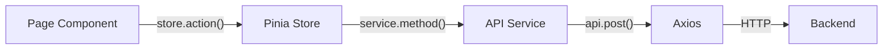
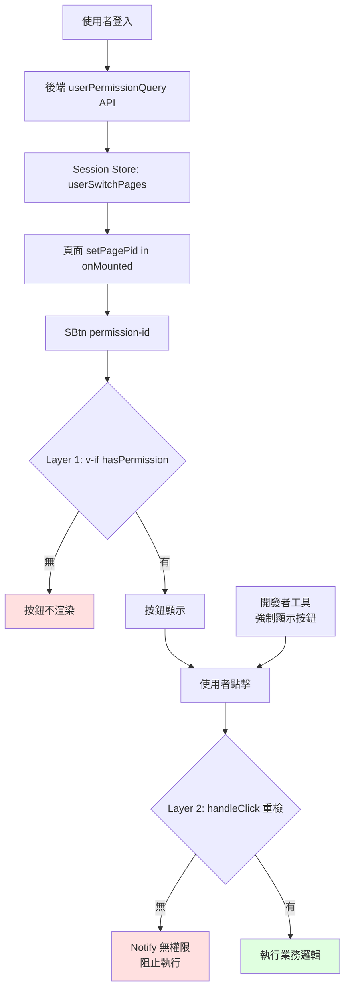

# 類 EAP 前端架構規範

← [返回架構規範總覽](./README.md)

| 項目 | 內容 |
| --- | --- |
| **文件編號** | EAP-ARCH-FE-001 |
| **適用範圍** | 所有「類 EAP 業務系統」之前端專案：以 Vue 3 + Quasar + TypeScript 為骨幹、與類 EAP 後端整合者 |
| **參考實作** | `/Users/ryan/Coding/Soetek/EAP_Group/eap/frontend`（Reference Implementation #1） |
| **生效日期** | 2026-04-30 |

---

## 0. 文件定位

本文件為「**類 EAP 前端的可重用架構規範**」，三段式結構：`規範` / `現況落差` / `建議增強（選用）`。

**規範範圍特別說明**：本文件**不引入**後端的 Hexagonal Architecture / Spring Modulith / Port-Adapter / Null Adapter 概念到前端。前端的「分層」概念與後端不同——前端外部依賴實質上只有後端 API，再加上一層 Port-Adapter 抽象只會變成樣板地獄。本文件以 **Vue 3 + Quasar 業界規範為主軸**，輔以可跨層套用的通用工程精神（DRY、No Hardcoding、單一真實來源、權限決策集中、錯誤處理一致）。

---

## 1. 技術棧骨幹

### 1.1 規範

| 類別 | 技術 | 版本下限 |
| --- | --- | --- |
| Framework | **Vue 3** + **Quasar** | Vue ≥ 3.4，Quasar ≥ 2.14 |
| 語言 | **TypeScript** strict mode | TS ≥ 5.0 |
| 編寫風格 | **Composition API + `<script setup>`**（強制） | — |
| 狀態管理 | **Pinia** + `pinia-plugin-persistedstate` | Pinia ≥ 3 |
| Router | **Vue Router 4**（hash 或 history） | — |
| HTTP | **Axios** + 攔截器鏈 | — |
| i18n | **vue-i18n**（與 Quasar Lang 同步） | — |
| 日期 | **dayjs** | — |
| Build | **Vite**（透過 `@quasar/app-vite`） | — |

**強制規定**：
- TS `strict: true`，禁止 `any`，禁止隱式 any
- `<script setup>` 是預設；`Options API` 與 setup() 函式式只在維護舊代碼時保留，新代碼一律 `<script setup>`
- Pinia 採**單一風格**（推薦 **Setup 風格**，與 `<script setup>` 一致）

### 1.2 現況落差

- ✅ EAP 已採此完整骨幹，TS strict 已開啟（`frontend/tsconfig.json:7`）
- ✅ 100% 採用 `<script setup>`（與 Flowable 前端 33% 形成對比）
- 🟡 **Pinia 風格混用**：
  - Setup 風格：`stores/au/au001/useApplicationStore.ts:15-180`（`ref`/`computed`/return 函式）
  - Object 風格：`stores/au/au002/useAu002Store.ts:44-227`（`state`/`getters`/`actions`）
  - 兩種共存，新人會猶豫該採哪種

### 1.3 建議增強

- **R1-1**：明文規定**新建 store 一律採 Setup 風格**；既有 Object 風格 store 不強制重寫，但若該檔需修改 ≥ 30% 時順手轉換。

---

## 2. 專案目錄結構

### 2.1 規範

```text
src/
├── boot/                    # Quasar 啟動檔（axios、i18n、components 註冊）
├── core/                    # 與業務無關的基礎設施
│   ├── constants/           # 全域常數（路徑、語言列表）
│   ├── locales/             # i18n 設定 + helper（$t、successMessage、failMessage）
│   ├── request/             # HTTP client 與攔截器
│   ├── stores/              # 跨模組共用 store（access、user、timezone）
│   ├── typings/             # 全域型別宣告
│   └── utils/
├── components/
│   └── common/              # s-* 設計系統元件（SBtn、STable2、SInput2 等）
├── composables/             # 跨頁可重用邏輯（useErrorHandler、useFormValidation、useLov）
├── layouts/                 # 版面（MainLayout）
├── pages/{module}/          # 頁面，依業務模組分群
├── router/                  # 路由 + 守衛
├── services/{module}/       # API 服務層（呼叫後端的具名函式）
├── stores/{module}/         # 業務 Pinia store
├── types/{module}/          # 業務型別定義（API 回應、Entity 模型）
├── utils/                   # 業務 utility
└── i18n/                    # 翻譯資源（JSON 檔，分模組）
```

**規範要點**：
- `core/` 為**基礎設施**（非業務）；新業務絕不放入
- `pages/`、`stores/`、`services/`、`types/` 採**相同的模組分群結構**（`au/`、`pm/`、`tm/` 等），方便定位
- **`services/` 是 API 邊界**：所有 axios 呼叫**必須**經服務層，禁止 component 直接 `api.post(...)`

### 2.2 現況落差

- ✅ 結構已完整實現
- 🟡 **`api/` 與 `services/` 雙存在**：`frontend/src/api/`（auth API legacy）+ `frontend/src/services/`（主流）。語意重疊，新人不知該用哪個。
- 🟡 i18n 資源同時放在 `i18n/` 與 `core/locales/`，分工不明

### 2.3 建議增強

- **R2-1**：明訂 `api/` 為棄用（deprecated），新呼叫一律進 `services/`；既有檔逐步遷移。
- **R2-2**：i18n JSON 集中於 `i18n/zh-TW/`、`i18n/en-US/`，`core/locales/` 僅放 setup 與 helper 函式。

---

## 3. 元件設計（s-* 設計系統）

### 3.1 規範

- 所有跨頁可重用 UI 元件**必須**前綴 `s-`（Soetek 設計系統），全域註冊於 `boot/components.ts`
- s-* 元件**必須**：
  1. 接受並轉發 Quasar 原生 props（`v-bind="$attrs"` 或明確列出）
  2. 提供具名 slot 對應 Quasar 對等位置
  3. props 使用 `interface` 加 `withDefaults(defineProps<Props>(), { ... })`
  4. 不寫死顏色/間距，遵守設計 token
- **權限相關元件必須具備雙層保護**（見第 6 章）

### 3.2 現況落差

- ✅ s-* 元件齊全（SBtn、STable2、SInput2、SSelect2、SDialog2 等 20+）
- ✅ 全域註冊於 `boot/components.ts:24-46`
- 🟡 **v1/v2 元件並存**：SInput vs SInput2、STable vs STable2 並存，新人不知該選哪個（CLAUDE.md 未明確說明 v2 為主流）

### 3.3 建議增強

- **R3-1**：在 `components/common/README.md` 中明訂「v2 為當前主流；v1 僅維護不再增功能」，並列出 v1 的退役計畫。

---

## 4. 狀態管理（Pinia）

### 4.1 規範

- **每個業務模組** 可有自己的 store，路徑 `stores/{module}/{page}/use{Page}Store.ts`
- **session store** 為跨模組單一真實來源，存放：當前使用者、權限矩陣、當前 pagePid、Token
- store 內**必須區分**：
  - **Server state**（從 API 取得的資料）
  - **UI state**（loading 旗標、dialog 開關）
- **載入旗標命名**統一為 `{operation}Loading`（`queryLoading`、`saveLoading`、`deleteLoading` 等）
- **驗證錯誤**集中於 store 中的 `validationErrors: ValidationErrors`
- **嚴禁**：跨 store 直接 import 對方的 state（避免循環依賴）；跨 store 通訊只能透過 session store 或事件

### 4.2 現況落差

- ✅ 命名規約遵守度高（`stores/au/au002/useAu002Store.ts:108-112` 有 `validationErrors`）
- 🟡 **頁面區域 loading 與 store loading 共存**：
  - 正確：`pages/au/au002/AU002.vue:278` 用 `computed(() => au002Store.queryLoading)`
  - 不一致：`pages/au/au002/UserDialog.vue:195` 用 `const saveLoading = ref(false)`（區域 ref，非 store）
- 🟡 Pinia 風格混用（已於第 1 章列出）

### 4.3 建議增強

- **R4-1**：規範「**所有非單次性的 loading 都進 store**」，避免重複狀態源。一次性如「按鈕點擊後等動畫」可保留區域 ref。

---

## 5. API 服務層

### 5.1 規範



- **禁止跨層直呼**：Page → Store → Service → axios 是**唯一允許的呼叫鏈**
- 每個 service 檔案**必須**：
  1. 命名為 `{module}{Page}Service.ts`
  2. export 一個 `const xxxService = { method1, method2 }` 物件
  3. 內部 endpoint 路徑列為**檔案頂部 const**：`const API_ENDPOINTS = { QUERY: '/au002/query', CREATE: '/au002/create' }`
  4. 每個 method 簽章帶**型別化** Request 與 Response：`async createUser(req: CreateUserReq): Promise<SingleResponse<User>>`
- **基礎 axios 攔截器**統一於 `boot/axios.ts`：
  - Request：注入 Authorization、X-Session-Id、X-CSRF-Token
  - Response：401 自動跳登入；SYS001（驗證錯誤）抽出 `validationErrors` 給 store；其他錯誤交 `useErrorHandler`

### 5.2 現況落差

- ✅ 服務層抽象完整（範本：`services/au/au002Service.ts:22-90`）
- ✅ 全域型別 `SingleResponse<T>`、`ListResponse<T>`、`OperationResponse` 已定義
- ✅ 攔截器處理 401 / SYS001 / 一般錯誤（`boot/axios.ts:193-260`）
- 🟡 **`baseURL` 過時**：`boot/axios.ts:348` 寫 `'http://localhost:8081/api'`，但 EAP 後端實際 port 是 **3500**（見 `EAP_Group/eap/backend/application/.../application.properties:4`）。雖然 `VITE_GLOB_API_URL` 環境變數會優先，但預設值已過時，會誤導新人。
- 🟡 **service 匯出風格不一**：部分 `export const xxxService = {...}`，部分 `export default {...}`

### 5.3 建議增強

- **R5-1**：修正 `axios.ts:348` 預設 `baseURL` 為 `'http://localhost:3500/api'`。
- **R5-2**：規範 `export const xxxService = { ... }` 為唯一風格，便於 IDE 重構與 import 清晰。

---

## 6. 權限控制（核心：SBtn 雙層保護）

### 6.1 規範

類 EAP 系統的權限模型：



**規範要點**：
- 所有需權限的按鈕**必須**用 `<s-btn permission-id="xxx" />`，**禁止**手動 `v-if="pageSettings.btnXxx"` 或在 handler 裡 `if (!perm) return`
- 每個頁面 **`onMounted`** **必須**呼叫 `sessionStore.setPagePid('XXX')`
- **禁止**在頁面定義 `pageSettings` 變數
- 雙層保護缺一不可：第一層 `v-if` 防 DOM 渲染，第二層 `handleClick` 防 devtools 強制顯示後繞過
- 權限資料**單一來源**：`sessionStore.userSwitchPages[pagePid][permissionId]`
- `permission-id` 命名**必須**為單一字串字面值（`"btnQuery"`），**禁止** 條件運算式

### 6.2 現況落差

- ✅ SBtn 雙層保護完整實作（`components/common/SBtn.vue:163-254`）
- ✅ Session store 結構正確（`stores/common/session.ts:36, 191-200`）
- ✅ CLAUDE.md 第 287-394 行已明文規範使用方式
- 🔴 **錯誤用法被偵測到**：`pages/au/au002/AU002.vue:177` 寫 `permission-id="btnResendEmail && props.row.emailVerified === 'N'"`

  問題：`permission-id` 期望單一字串字面值，這裡卻塞了條件運算式。`&&` 結果是 boolean，當作 permission key 查表會永遠拿不到對應權限。

  正確寫法：
  ```vue
  <s-btn
    v-if="props.row.emailVerified === 'N'"
    permission-id="btnResendEmail"
    ...
  />
  ```

### 6.3 建議增強

- **R6-1**：在 SBtn 內部對 `permissionId` props 加上 dev-mode 警告：若值含 `&&`、`||`、空白、變數樣式（駝峰外的字元），於 console 印 warn。
- **R6-2**：寫一個簡易 ESLint plugin 或 grep 在 CI：`grep -rn 'permission-id="[^"]*[\s&|]' src/` 直接 fail build。

---

## 7. 路由與守衛

### 7.1 規範

- 所有路由**必須**懶載入：`component: () => import('pages/...')`
- Route meta 必填：
  - `requiresAuth: boolean`（預設 true，公開頁面顯式設 false）
  - `pid: string`（對應後端權限矩陣的頁面 ID）
  - `title: string`（i18n key 或固定字串）
- **Auth Guard 必須啟用**：`router.beforeEach` 內檢查 `sessionStore.isAuthenticated`，未登入導向 `/login`
- **頁面權限**檢查交給後端的 `userMenus` 過濾 + SBtn 兩層保護，路由層**不做** `permission-id` 級判斷

### 7.2 現況落差

- ✅ Auth guard 已啟用（`router/index.ts:33-57`）
- ✅ Lazy loading、meta 規範遵守
- ⚠️ **與 Flowable 前端的對比**：Flowable 前端的 auth guard 整段被註解（`/Users/ryan/Coding/Soetek/flowable/frontend/src/router/index.ts:38-47`），新類 EAP 專案需特別警示。

### 7.3 建議增強

無特別建議。EAP 此處已是標竿。

### 7.4 SSO 登入流程（選用）

> 對應後端 [`eap-backend.md` §8 SSO 整合](./eap-backend.md#8-sso-整合選用)。當後端 `auth.mode != local` 時，前端**必須**遵守此流程。

**規範**：

- **登入頁顯示策略**：依後端回傳的 `auth.mode` 決定按鈕：
  - `local` → 只顯示「本地帳號登入」表單
  - `sso` → 直接 redirect 到 `/api/auth/sso/start`，不顯示表單
  - `hybrid` → 兩者並存，「以 SSO 登入」按鈕為主、本地表單為次
- **前端不持有 IdP 資訊**：`client_id`、`issuer_url` 等 IdP 配置**不應**出現在前端程式碼或 .env；登入起點由後端 `/api/auth/sso/start` 產生 redirect URL
- **PKCE / state 由後端管理**：前端**不參與** PKCE `code_verifier` 生成（OWASP 建議由 backend-for-frontend 統一）
- **Callback 不經前端**：IdP 將 `code` 重導回 `EAP_BE/api/auth/sso/callback`，後端換完 token 後再 302 回前端首頁並 Set-Cookie；前端**不接觸** authorization code
- **前端只看內部 JWT**：透過 httpOnly cookie 或 `/api/me` 取得；**禁止**將 IdP `access_token` 存入 localStorage / sessionStorage
- **登出**：呼叫 `POST /api/auth/sso/logout` → 後端回 302 至 IdP `end_session_endpoint`，前端跟隨 redirect

**前端登入頁 pseudo-code**：

```ts
// pages/common/LoginPage.vue
const authMode = ref<'local' | 'sso' | 'hybrid'>('local')

onMounted(async () => {
  // 後端開放公開 API 回傳目前模式（不含敏感配置）
  const { data } = await api.get<{ mode: 'local' | 'sso' | 'hybrid' }>('/auth/mode')
  authMode.value = data.mode

  if (authMode.value === 'sso') {
    window.location.href = '/api/auth/sso/start'
  }
})

const ssoLogin = () => {
  window.location.href = '/api/auth/sso/start'
}

const localLogin = async () => {
  await sessionStore.userLogin({ userAccount: ..., password: ... })
  router.replace('/')
}
```

**現況落差**：當前 EAP 前端僅實作本地帳密登入（`pages/common/LoginPage.vue` 與 `stores/common/session.ts:6-200`），未含 SSO redirect 邏輯。新類 EAP 系統若一開始即 `auth.mode != local`，需新增上述 pseudo-code 對應實作。

**建議增強**：

- **R7-4-1**：登入頁的兩種模式不必硬寫 if-else，抽 `useLoginMode` composable 由 `/auth/mode` 拉資訊後動態組裝。
- **R7-4-2**：SSO redirect 失敗（IdP timeout、500）後的 fallback UI 需明確（Notify + 重試按鈕），避免使用者卡白畫面。

---

## 8. 錯誤處理

### 8.1 規範

兩層處理鏈：

| 層級 | 負責 | 實作 |
| --- | --- | --- |
| **HTTP 攔截器層** | 翻譯 HTTP 錯誤碼為標準格式，特殊碼分流 | `boot/axios.ts` |
| **使用者展示層** | i18n 錯誤訊息、決定 Notify / Dialog 樣式 | `composables/useErrorHandler.ts` |

- **驗證錯誤（SYS001）**：攔截器抽出 `validationErrors` 寫進 store，由 `useFormValidation` composable 在欄位旁顯示
- **業務錯誤**（其他 code）：透過 `useErrorHandler.handleApiError(err, customHandlers?)` 處理；customHandlers 允許每個頁面覆寫特定 code
- 所有錯誤訊息**必須**走 i18n key，**禁止**寫死中英文於 throw / log
- store action 內**必須** try/catch；catch 內**必須** rethrow 或將錯誤狀態寫入 `validationErrors` / `errorMessage`

### 8.2 現況落差

- ✅ 攔截器處理完整（`boot/axios.ts:215-260`）
- ✅ `useErrorHandler` composable 設計良好（`composables/useErrorHandler.ts:28-204`）
- ✅ `useFormValidation` 與 SYS001 整合（`composables/useFormValidation.ts:63-119`）
- 🟡 **Error Boundary 缺失**：Vue 3 提供 `errorCaptured` hook 與 `app.config.errorHandler`，但 EAP 未實作全域 error boundary。元件內未捕獲的同步例外會冒泡到 Vue 並可能讓畫面卡住。

### 8.3 建議增強

- **R8-1**：在 `boot/error-boundary.ts` 加上 `app.config.errorHandler`，未捕獲例外統一交 `useErrorHandler` 顯示 dialog 並上報。

---

## 9. 表單驗證

### 9.1 規範

- 規則**必須**抽取為 const 陣列（**不要**直接寫在 template 內）
- 規則**必須** i18n 化
- 「前端規則」與「後端 SYS001 驗證」共存：前者擋使用者輸入錯誤，後者擋 race condition 與資料庫級規則
- `useFormValidation` composable 提供統一介面：`hasError(fieldName)`、`getErrorMessage(fieldName)`、`clearError(fieldName)`

### 9.2 現況落差

- ✅ 整合機制已建立（attr 寫法 + composable）
- 🟡 **規則散落**：每個 dialog 各自定義 `userAccountRules`、`emailRules` 等。重複規則（如 email 格式）會在多處複製。

### 9.3 建議增強

- **R9-1**：建立 `core/utils/validators.ts` 作為共用規則庫，例如 `requiredText(label)`、`emailRule()`、`onlyAlpha(maxLen)` 等，回傳 Quasar `:rules` 期望的函式陣列。各頁面組合使用。

---

## 10. i18n 與設計 Token

### 10.1 規範

- **100% UI 字串必須走 i18n**：禁止 template / script 內寫中英文字面值
- i18n key **必須**有層次：`{module}.{page}.{element}`（例：`au.au002.queryButton`）
- 每個頁面**必須**定義 `const i18nPrefix = 'au.au002.'`，後續 `$t(i18nPrefix + 'xxx')`，避免長字串散落
- **語言切換**：透過 Quasar `Lang.set()` 與 vue-i18n `locale.value =` 同步
- **顏色與間距**走 Quasar brand + `q-pa-md` 等 utility class，禁止行內 `style="color: #xxx; padding: 12px"`

### 10.2 現況落差

- ✅ i18n 覆蓋率高，命名規約遵守
- ✅ 設計 Token 採 Quasar utility class（`q-mb-md`、`text-primary`）
- 🟡 部分頁面顏色仍寫死於 class（如 `class="bg-deep-orange"`），但屬於可接受的設計選擇

### 10.3 建議增強

無重大建議。EAP 此處表現優於 Flowable 前端。

---

## 11. 型別安全（TypeScript Strict）

### 11.1 規範

- `tsconfig.json: strict: true`
- **禁止** `any`（包括 `Record<string, any>`）；不確定的場景用 `unknown` + type guard
- 所有 API 回應**必須**型別化（`SingleResponse<T>`、`ListResponse<T>`）
- 所有 store state、props、emits 採 `interface` 明確定義
- defineProps / defineEmits **必須**用泛型形式而非物件形式：

  ```ts
  // ✅
  const props = defineProps<{ id: string; mode: 'create' | 'edit' }>()

  // ❌
  const props = defineProps({ id: { type: String }, mode: { type: String } })
  ```

### 11.2 現況落差

- ✅ Strict 已啟用，多數 API 與 store 型別化完整
- 🟡 **動態表單區仍有 `Record<string, any>`**：`pages/au/au002/UserDialog.vue:195` 等處用區域 `ref`，型別未指定

### 11.3 建議增強

- **R11-1**：對「動態欄位」場景，提供型別化容器：`type FormState<T> = Partial<T> & { _meta: { dirty: boolean } }`，避免裸 `any`。

---

## 12. 開發 Checklist

### 12.1 元件與頁面

- [ ] `<script setup lang="ts">` + Composition API
- [ ] props/emits 用泛型 defineProps / defineEmits
- [ ] 共用元件前綴 `s-`，全域註冊於 `boot/components.ts`
- [ ] 頁面 `onMounted` 呼叫 `sessionStore.setPagePid('XXX')`
- [ ] **權限按鈕用 `<s-btn permission-id="xxx" />`，permission-id 為單一字串字面值**

### 12.2 狀態與 API

- [ ] 業務 store 命名 `use{Module}{Page}Store`
- [ ] 採 Setup 風格（新建）
- [ ] loading 旗標命名 `{operation}Loading` 並放 store
- [ ] 所有 axios 呼叫經 service 層
- [ ] service 為 `export const xxxService = {...}` 物件
- [ ] API 路徑列於檔案頂部 const

### 12.3 型別與 i18n

- [ ] 無 `any` / `Record<string, any>`
- [ ] API 回應走 `SingleResponse<T>` / `ListResponse<T>`
- [ ] 所有 UI 字串走 `$t(i18nPrefix + 'xxx')`
- [ ] 規則定義抽出為 const 陣列、i18n 化

### 12.4 路由與權限

- [ ] route meta 含 `requiresAuth`、`pid`、`title`
- [ ] auth guard 啟用且未被註解
- [ ] 路由不做 permission-id 級判斷

### 12.5 錯誤處理

- [ ] store action 必有 try/catch
- [ ] 透過 `useErrorHandler.handleApiError` 顯示
- [ ] 全域 `app.config.errorHandler` 已註冊（R8-1）

---

## 13. 變更歷程

| 版本 | 日期 | 變更摘要 | 變更者 |
| --- | --- | --- | --- |
| 1.0.0 | 2026-04-30 | 初版發佈，自當前 EAP frontend 歸納而成；不引入後端 Hexagonal/Modulith 概念 | 架構整理 |
| 1.1.0 | 2026-04-30 | §7 新增 §7.4 SSO 登入流程（選用），對應後端 §8 SSO 整合 | 架構整理 |

---

← [返回架構規範總覽](./README.md)
