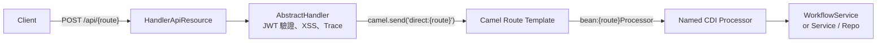
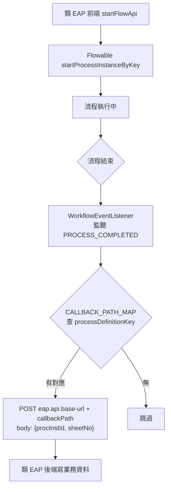

# 類 Flowable 後端架構規範

← [返回架構規範總覽](./README.md)

| 項目 | 內容 |
| --- | --- |
| **文件編號** | FLOW-ARCH-BE-001 |
| **適用範圍** | 所有「類 Flowable 工作流系統」之後端專案：以 Quarkus + Apache Camel + Flowable BPMN 引擎為骨幹、為其他業務系統（類 EAP）提供集中式工作流服務者 |
| **參考實作** | `/Users/ryan/Coding/Soetek/flowable/backend`（Reference Implementation #1） |
| **參考規範** | `/Users/ryan/Coding/Soetek/project-init.md`（Spring Boot 版，本文件已轉換為 Quarkus） |
| **生效日期** | 2026-04-30 |

---

## 0. 文件定位

本文件為「**類 Flowable 工作流系統的可重用架構規範**」。三段式結構：`規範` / `現況落差（以當前 Flowable 為例）` / `建議增強（選用）`。

**特別說明**：類 Flowable 系統與類 EAP 系統的架構約束**根本不同**——
- **類 EAP** = 業務領域系統，業務邏輯為核心，工作流為附加能力
- **類 Flowable** = 工作流引擎服務，BPMN 為核心，業務系統透過 API 呼入

因此本文件的**規範重心**在於「如何當好一個工作流引擎服務」、「如何為多個類 EAP 系統提供穩定的契約」，而不是業務領域分割。

---

## 1. 系統技術骨幹

### 1.1 規範

| 類別 | 技術 | 用途 |
| --- | --- | --- |
| Runtime | **Quarkus 3.x** | 與類 EAP 同骨幹，便於團隊跨專案協作 |
| BPMN 引擎 | **Flowable 7.x** | `flowable-engine` + `flowable-camel`（如需與 Camel 整合） |
| 動態整合 | **Apache Camel 4.x** | 與類 EAP 共用 Route Template 模式 |
| 腳本擴充 | **Groovy JSR223**（`groovy-jsr223`） | BPMN Script Task 動態邏輯 |
| ORM | **Hibernate ORM with Panache** | 業務資料持久化 |
| DB | **MSSQL Server**（雙 Schema） | 一個 schema 給 Flowable 引擎（`workflow.ACT_*`），一個給應用 |
| 認證 | **SmallRye JWT (RS256)** | 與類 EAP 共用 JWT 簽發/驗證機制 |
| Migration | **Flyway** | 兩個 schema 並行管理 |

### 1.2 現況落差

- ✅ 已採此完整骨幹，Flowable 版本 7.2.0（見 `/Users/ryan/Coding/Soetek/flowable/backend/core/pom.xml:187-203`）
- ✅ Flowable schema 與應用 schema 由 `application.properties:28-67` 與 Flyway 共同管理

### 1.3 建議增強

無。

---

## 2. 模組切分

### 2.1 規範

類 Flowable 系統因其「**核心是 BPMN 引擎，業務模組相對輕量**」的特性，模組切分原則：

- **`core/` 模組**：所有共用基礎設施
  - API 入口、JWT、HttpHandler 抽象基類
  - **`WorkflowService`**（最核心）：BPMN 引擎的全部 facade
  - 共用 Util（JSON、XSS、密碼、Token、Report）
  - `AuditableEntity` 基底類
- **`admin/` 模組**：身份、角色、權限、流程管控與審核管理
- **業務模組**（`general-ledger/`、`inventory/`、`material/` 等）：純 CRUD/查詢，**不直接呼叫** Flowable 引擎，需要時統一經過 `WorkflowService`
- **`application/` 模組**：唯一啟動點

模組依賴方向：`業務模組 → core ← admin`，**禁止**業務模組依賴 admin、admin 依賴業務模組。

**BPMN 檔案位置規範**：
- `.bpmn20.xml` 一律放於 **`admin/src/main/resources/workflow/`**
- 檔名命名 = kebab-case 的 process key（例：`person-request.bpmn20.xml`、`leave-and-resign.bpmn20.xml`）
- 此規範使 `WorkflowService.deployProcess()` 能依 process key 自動定位檔案

### 2.2 現況落差

- ✅ 模組切分清晰，BPMN 檔案集中於 `flowable/backend/admin/src/main/resources/workflow/`
- 🟡 業務模組（gl、inv、material）**完全沒有 service 層**：所有邏輯寫在 Processor 內。簡單 CRUD 可接受，但**未來擴展到複雜業務**時會重複類 EAP 已遇到的問題。

  舉例：`flowable/backend/general-ledger/.../processor/GlCurrencyMaintainProcessor.java:59-112` 直接在 Processor 中執行驗證 + 持久化。

### 2.3 建議增強

- **R2-1**：規定業務模組的 Service 抽出門檻（同類 EAP 規範第 4 章）：超過 30 行或含 2+ 副作用即抽。

---

## 3. API 入口與動態註冊

### 3.1 規範

與類 EAP 完全一致的單一入口模式：



**強制規定**：
- **單一 JAX-RS 入口**：`HandlerApiResource @Path("/api") @POST @Path("/{route}")`
- **動態註冊**：所有 Processor `@ApplicationScoped @Named("{routeId}Processor") @RegisterForReflection`，由 `RouteTemplateRegister` 啟動時掃描
- **AbstractHandler 集中前置處理**：JWT 驗證、XSS 清理、TraceId 設定。Processor 不重複處理
- 路由 ID 由 path param 規範化（snake_case → camelCase）以容忍前端拼寫差異

### 3.2 現況落差

- ✅ 完整實作（見 `core/src/main/java/org/soetek/api/HandlerApiResource.java:43-56`、`AbstractHandler.java:59-95`、`config/RouteTemplateRegister.java:44-54`）

### 3.3 建議增強

無。此模式與類 EAP 共享，跨專案有極佳的可預期性。

---

## 4. WorkflowService — 工作流核心 Facade

### 4.1 規範

**`WorkflowService` 是類 Flowable 系統的核心抽象**，所有對 Flowable 引擎的呼叫**必須**經此 facade，**禁止**業務 Processor / Service 直接 inject `RuntimeService`、`TaskService`、`RepositoryService`。

理由：
1. 集中所有 BPMN 互動，未來換引擎僅改一處
2. 可在此實作交叉關注點：權限前檢、變數預設、事件 listener 觸發、callback 註冊
3. 測試時可 Mock 此 facade，避免每個測試都要啟動 Flowable engine

WorkflowService **必須**至少包含的方法群：

| 方法群 | 用途 |
| --- | --- |
| `deployProcess(clazz, key, name)` | BPMN 部署（含 `enableDuplicateFiltering()`） |
| `startProcess(clazz, key, applicant, payload)` | 啟動流程 + 自動完成第一個任務（applicant 為起單人） |
| `startProcessOnly(...)` | 啟動但不自動完成（用於多人會簽起點） |
| `completeTaskWithVariables(taskId, local, process)` | 完成任務 + 區分 local/process variable 範圍 |
| `getCurrentTask(procInstId)` | 取得目前活動 task |
| `getProcessHistory(procInstId)` | 取得歷史軌跡 |
| `callbackOnProcessCompleted(procInstId, sheetNo, key)` | 流程完成回呼業務系統（見第 6 章） |

### 4.2 現況落差

- ✅ `WorkflowService` 已是 facade，覆蓋上述所有方法（`flowable/backend/core/src/main/java/org/soetek/service/WorkflowService.java`，60+ 方法）
- 🟡 **檔案過於龐大**（1700+ 行）：所有流程相關邏輯擠在一個類別。違反 SRP。
- 🟡 **Process Variable 預設值散落**：`startProcess` 內手動 `payload.put("applicant", applicant)`、`payload.put("auditHistory", new ArrayList<>())`（`WorkflowService.java:135-139`）。新增流程時容易漏設。

### 4.3 建議增強

- **R4-1：拆分 WorkflowService 為多個職責明確的 Service**

  ```text
  WorkflowDeploymentService    # 部署相關
  WorkflowStartupService       # 流程啟動
  WorkflowTaskService          # 任務操作
  WorkflowQueryService         # 查詢/歷史
  WorkflowCallbackService      # 回呼派發（CALLBACK_PATH_MAP 與 HTTP 呼叫）
  ```

  外部仍透過共同介面 `WorkflowFacade` 取得，內部委派給上述 Service，便於單元測試。

- **R4-2：Process Variable 預設值集中化**

  以 `ProcessDefaultVariablesProvider` 介面 + `Map<processKey, Provider>` 註冊，啟動流程時 facade 自動注入。新增流程只需新增 Provider，不必改 WorkflowService。

---

## 5. Process Variable 範圍規範

### 5.1 規範

Flowable 流程變數**必須**明確分為兩類，混用會造成資料汙染：

| 範圍 | 用途 | API |
| --- | --- | --- |
| **Process variable** | 跨任務、條件式、子流程共用 | `setVariables()` / `setVariable()` |
| **Task local variable** | 僅該任務內有效，例如該關卡填寫的表單值、簽核意見 | `setVariablesLocal()` / `setVariableLocal()` |

**規範要點**：
- **API 端點 `completeTask` 必須**接受 `localVariables` 與 `processVariables` 兩個獨立物件
- 表單原始填寫值 → **local**（避免後續關卡覆寫之前關卡的填寫紀錄）
- 流程決策資料、累計欄位（如 `auditHistory`）→ **process**
- **禁止**透過 `setVariable` 把整個 form 物件丟到 process scope，導致歷史關卡的填寫被洗掉

### 5.2 現況落差

- ✅ `CompleteTaskWithVariablesProcessor` 已正確區分（同時接受 local 與 process）
- 🟡 **規範文件未明文**：CLAUDE.md / README 沒寫清楚什麼資料該 local、什麼該 process。新加流程的開發者只能參考既有 BPMN 模仿，容易出錯。

### 5.3 建議增強

- **R5-1**：在 `Docs/process-variable-guideline.md` 用範例說明分類原則：

  | 資料類型 | 範圍 |
  | --- | --- |
  | 表單填寫原始值（form fields） | local |
  | 簽核意見、決策（agree/disagree） | local |
  | 起單人 applicant | process |
  | 累計清單（auditHistory、participants） | process |
  | 流程主鍵（sheetNo、procInstId） | process |
  | 動態路由判斷依據（amount、orgLevel） | process |
  | 附件 ID 列表 | local（檔案本身存於 EAP 或 attachment table） |

---

## 6. 與外部系統的回呼契約（核心）

### 6.1 規範

類 Flowable 系統作為**集中工作流服務**，必須提供清晰且可擴展的「**流程完成回呼**」機制供類 EAP 系統訂閱：



**規範要點**：
- **單一中央註冊表 `CALLBACK_PATH_MAP`**：所有回呼路徑集中於 `WorkflowService` 的常數 Map（或 R6-1 的設定檔）
- **回呼 payload 統一為 `{procInstId, sheetNo}`**；如業務系統需要更多資料，**必須**反向查詢（業務系統用 `procInstId` 查 Flowable）而非塞進 callback body
- **回呼 URL = `${eap.api.base-url}${callbackPath}`**，base url 由設定檔注入，**禁止**寫死於程式碼
- **非阻塞 + 降級**：HTTP 失敗**不回滾**流程完成，僅記 log
- **冪等性要求**：類 EAP 端的 callback handler **必須**冪等（同 procInstId 重送結果一致）。理由：Flowable engine 重啟、retry 都可能重發
- **公開白名單，但需 HMAC**：類 EAP 端 callback API 設為公開（無 JWT），但**必須**驗證 HMAC 簽章避免偽造（見類 EAP 後端規範 R7-1）

### 6.2 現況落差

- ✅ `CALLBACK_PATH_MAP` 模式已建立於 `core/src/main/java/org/soetek/service/WorkflowService.java:1665-1669`
- ✅ 失敗降級正確（`WorkflowService.java:1722-1726` 失敗只 log）
- 🔴 **HMAC 簽章未實作**：呼叫端目前送純 JSON 無 signature header（`WorkflowService.java:1710-1715`），類 EAP 端也未驗證
- 🟡 **CALLBACK_PATH_MAP 是 hard-coded `Map.of()`**：新增流程必須改 Java 程式碼重新部署。理想為設定檔驅動。
- 🟡 **payload 寫死字串拼接**：`String.format("{\"procInstId\":\"%s\",...")`（`WorkflowService.java:1703`），有 JSON escape 風險。
- 🟡 **目前 Map 只有一筆**：`"PersonRequest" → "/api/rm003WorkflowCallback"`。但類 EAP 端有 `pm003WorkflowCallback` Processor，顯示 pm003 流程是用「BPMN Script Task 直接呼叫」或其他繞過 CALLBACK_PATH_MAP 的方式。**雙軌並存會讓回呼來源不可預測**。

### 6.3 建議增強

- **R6-1（必做）：HMAC 簽章**

  Flowable 端：
  ```java
  String signature = HmacSha256.sign(secret, jsonBody + timestamp);
  request.header("X-Callback-Signature", signature);
  request.header("X-Callback-Timestamp", String.valueOf(timestamp));
  ```

  類 EAP 端在 callback Processor 第一行驗證。secret 由共用 ENV 變數提供。

- **R6-2：用 `ObjectMapper` 序列化 payload**，淘汰字串拼接。

- **R6-3：CALLBACK_PATH_MAP 改為設定檔**

  ```properties
  callback.path.PersonRequest=/api/rm003WorkflowCallback
  callback.path.LeaveAndResign=/api/pm003WorkflowCallback
  ```

  使用 `@ConfigProperties` 注入 Map。新增流程不必動 Java 程式碼。

- **R6-4：禁止 BPMN Script Task 直接 call EAP**

  所有出 Flowable 的呼叫**必須**經 callback registry，**不可** Script Task 用 Groovy 自己 `HttpClient.send()`。理由：避免「兩套回呼路徑」分裂維運注意力。

---

## 7. JWT、Session 與權限

### 7.1 規範

- **JWT** 使用 SmallRye JWT (RS256)，公私鑰於 `META-INF/resources/{publicKey,privateKey}.pem`
- **Token claim 必須**包含：`sub`（userAccount）、`roles`、`sessionId`、`traceId`
- **`UserSessionEntity`** 採「**JWT + 滑動視窗 Session**」混合模式：
  - JWT 為主要憑證（無狀態）
  - Session table 紀錄裝置綁定 / 強制登出 / 滑動視窗刷新
  - **每個請求**經 `AbstractHandler` 驗證 sessionId 是否仍有效（避免單純 JWT 無法強制登出的問題）
- **白名單路徑**集中於 `quarkus.http.auth.permission.permit-public.paths`，所有公開的 API 一目了然
- **角色檢查**透過 `quarkus.http.auth.policy.jwt-policy.roles-allowed`，至少有 `admin`、`user` 兩階

### 7.2 現況落差

- ✅ JWT + Session 混合模式實作完整（`flowable/backend/core/src/main/resources/application.properties:97-103, 105-135`）
- ✅ `AbstractHandler.java:68-95` 處理驗證
- 🟡 **白名單清單過長**：`application.properties:106` 有 50+ 個 API 列為公開（包含 `startFlow`、`completeTask`、`auditFlow` 等核心操作）

  影響：**任何能連到 8081 port 的人都能啟動流程、完成任務**。雖然從表單變數可知是哪個應用層使用者操作（applicant），但網路層完全不擋。

### 7.3 建議增強

- **R7-1（必做）：縮減白名單**

  類 Flowable 系統的 API **不應**有這麼多公開端點。除了登入、註冊與健康檢查，其他**全部**應走 JWT。

  目前過度公開的根因可能是「類 EAP 前端尚未實作把 JWT 帶到 Flowable 後端」。應該補齊前端的 token forward 機制，而非把 API 設公開。

- **R7-2：流程啟動需檢查 applicant ↔ JWT 是否一致**

  確保 JWT subject = payload 中的 applicant，避免 A 使用者用自己的 token 幫 B 起單。

---

## 8. DTO、Mapper 與 No Hardcoding

### 8.1 規範

與類 EAP 後端規範完全一致，不重複論述。重點：

- API Request / Response **必須**型別化（Java `record`）
- DTO ↔ Entity 映射用 **MapStruct**
- Magic string 集中於 Constants
- 有限選項用 Enum

### 8.2 現況落差

🔴 與類 EAP 後端有相同問題：

- 全部以 `Map<String, Object>` 流通（`HandlerApiResource.java:49`）
- 內部以 `JsonUtil.toObject(map, Class)` 即興轉型（`general-ledger/.../GlCurrencyMaintainProcessor.java:71`）
- AuditableEntity 內 `@PrePersist` 直接 `LocalDateTime.now()` 寫死格式（無問題，但類似 pattern 重複出現）
- API path、JWT claim、callback path 字串散落

### 8.3 建議增強

同類 EAP 後端 R5-1 ～ R5-3、R11-1 ～ R11-3。**新類 Flowable 專案應第一天即採行 record DTO**。

---

## 9. AuditableEntity 與審計

### 9.1 規範

- 所有業務實體**必須**繼承 `AuditableEntity`（或對應 schema 的基底類）
- `AuditableEntity` 透過 JPA `@PrePersist` / `@PreUpdate` 自動填入 `createDt`、`createUser`、`updateDt`、`updateUser`
- 「目前使用者」由 `SecurityIdentity` 取，無使用者時填 `"system"`
- Flowable 引擎自身的 history 設為 `flowable.history=full`，所有任務、活動、變數變更皆記錄

### 9.2 現況落差

- ✅ `AuditableEntity` 已實作（`flowable/backend/core/src/main/java/org/soetek/domain/AuditableEntity.java:62-76`）
- ✅ Flowable history full 已設定（`application.properties:170`）

### 9.3 建議增強

無。

---

## 10. 設定外部化與環境差異

### 10.1 規範

- **每個環境** 提供 `application-{profile}.properties`（dev / test / prod）
- 跨環境變動的值（DB URL、callback URL、SMTP、SECRET）**必須**從 ENV 變數注入：`${EAP_API_BASE_URL:http://localhost:3500}` 形式
- **dev profile 必須**能不依賴外部服務啟動（DB 不開、SMTP 不通也能起）

### 10.2 現況落差

- ✅ ENV 變數注入做得多
- 🟡 dev profile 不能完全離線啟動（無 DB / Flowable schema 即啟動失敗），與 project-init.md 「Graceful Degradation」精神有落差

### 10.3 建議增強

- **R10-1（選用）**：對非核心外部依賴（callback HTTP、Email、Redis）採 Null Adapter 模式（同類 EAP 後端 R8-1）。**但 Flowable engine 本身與其 DB 是核心，不該降級**——這是與類 EAP 不同之處。

---

## 11. 目錄結構參考

```text
backend/
├── pom.xml
├── application/                            # 啟動模組
├── core/                                   # 核心基礎設施
│   ├── api/
│   │   ├── HandlerApiResource.java         # JAX-RS 入口
│   │   └── AbstractHandler.java            # JWT、XSS、Trace 集中處
│   ├── config/
│   │   ├── ApiRouteTemplate.java
│   │   ├── RouteTemplateRegister.java
│   │   └── workflow/
│   │       ├── WorkflowConfig.java
│   │       ├── WorkflowEventListener.java  # 觸發 callbackOnProcessCompleted
│   │       └── CustomProcessDiagramCanvas.java
│   ├── domain/
│   │   ├── AuditableEntity.java
│   │   └── UserSessionEntity.java
│   ├── processor/
│   │   ├── ApiRouteProcessor.java          # 抽象基底
│   │   └── (Generic CRUD/Query)
│   ├── repository/
│   ├── service/
│   │   ├── WorkflowService.java            # （建議拆為 R4-1 多個）
│   │   ├── WorkflowDeploymentService.java
│   │   ├── WorkflowStartupService.java
│   │   ├── WorkflowTaskService.java
│   │   ├── WorkflowQueryService.java
│   │   └── WorkflowCallbackService.java    # 集中 callback registry
│   └── util/
│       ├── TokenGenerator.java
│       ├── PasswordUtil.java
│       └── XssSanitizer.java
│
├── admin/                                  # 流程審核、權限管理
│   ├── domain/
│   ├── processor/                          # auLogin、startFlow、completeTask、auditFlow...
│   └── resources/
│       └── workflow/                       # ★ 所有 BPMN 集中於此
│           ├── leave-and-resign.bpmn20.xml
│           ├── person-request.bpmn20.xml
│           └── ...
│
└── {business-module}/                      # 業務模組（gl/inv/material）
    ├── domain/
    └── processor/
```

---

## 12. 開發 Checklist

### 12.1 BPMN

- [ ] 檔名 = `{kebab-case-process-key}.bpmn20.xml`
- [ ] 放於 `admin/src/main/resources/workflow/`
- [ ] 流程設計時明確區分 process / local variable
- [ ] Script Task 不直接打 EAP HTTP（R6-4）
- [ ] 在 `CALLBACK_PATH_MAP`（或 R6-3 的設定檔）登記 callback 路徑

### 12.2 API

- [ ] Processor 繼承 `ApiRouteProcessor` + `@Named` 完整
- [ ] 公開 API 列入 `permit-public.paths`，但**業務操作**避免列為公開（R7-1）
- [ ] 所有對 Flowable engine 的呼叫經 `WorkflowFacade`（不直接 inject `RuntimeService`、`TaskService`）

### 12.3 Callback 契約

- [ ] callback payload 用 `ObjectMapper` 序列化（R6-2）
- [ ] HMAC 簽章送出（R6-1）
- [ ] 失敗 log 但不阻擋流程完成
- [ ] 業務系統端 callback handler 為**冪等**

### 12.4 安全

- [ ] JWT 公私鑰外部化
- [ ] 流程啟動驗 applicant ↔ JWT subject 一致（R7-2）
- [ ] 白名單清單列舉於 `application.properties` 並定期審視

### 12.5 No Hardcoding

- [ ] DTO 用 record，禁止 `Map<String, Object>` 邊界
- [ ] DateTimeFormatter / API path / Schema 名稱集中於 Constants
- [ ] callback path 不寫死於 Java（用 R6-3 設定檔）

---

## 13. 變更歷程

| 版本 | 日期 | 變更摘要 | 變更者 |
| --- | --- | --- | --- |
| 1.0.0 | 2026-04-30 | 初版發佈，自當前 Flowable backend 歸納而成 | 架構整理 |

---

← [返回架構規範總覽](./README.md)
