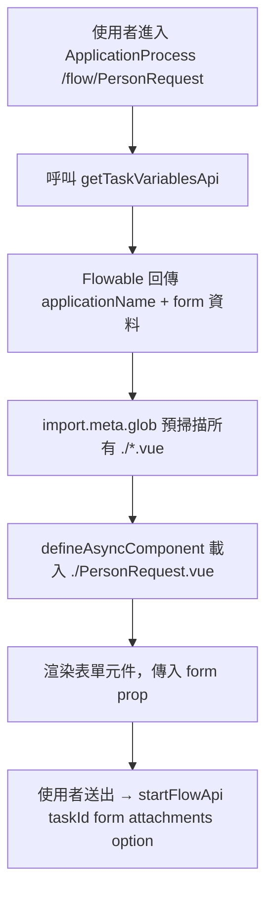

# 類 Flowable 前端架構規範

← [返回架構規範總覽](./README.md)

| 項目 | 內容 |
| --- | --- |
| **文件編號** | FLOW-ARCH-FE-001 |
| **適用範圍** | 所有「類 Flowable 工作流系統」之前端專案：以 Vue 3 + Quasar + TypeScript 為骨幹、提供流程申請與簽核介面者 |
| **參考實作** | `/Users/ryan/Coding/Soetek/flowable/frontend`（Reference Implementation #1） |
| **生效日期** | 2026-04-30 |

---

## 0. 文件定位

本文件為「**類 Flowable 前端的可重用架構規範**」。三段式：`規範` / `現況落差` / `建議增強（選用）`。

**不引入後端 Hexagonal/Modulith 概念到前端**（同類 EAP 前端規範）。本文件以 Vue 3 + Quasar 業界規範為主，並特別處理「**流程申請、簽核、流程圖呈現**」這類工作流前端特有的關注點。

**與類 EAP 前端的差異**：類 Flowable 前端**不擁有業務領域**，它是「流程引擎的 UI 殼」。多數業務資料由表單暫存於 Flowable process variable，由後端的類 EAP 系統最終消費。因此前端關注點偏重：
1. 動態表單載入（依流程類型決定渲染哪個元件）
2. 任務列表（已申請 / 待簽核）
3. 流程圖呈現
4. 簽核動作（同意 / 退回 / 加簽）

---

## 1. 技術棧骨幹

### 1.1 規範

與類 EAP 前端**共用同一骨幹**（理由：團隊跨專案協作、設計系統重用）：

| 類別 | 技術 | 版本下限 |
| --- | --- | --- |
| Framework | Vue 3 + Quasar | Vue ≥ 3.4，Quasar ≥ 2.14 |
| 語言 | TypeScript strict mode | TS ≥ 5.0 |
| 編寫風格 | **Composition API + `<script setup>` 強制** | — |
| 狀態 | Pinia + persistedstate | Pinia ≥ 3 |
| Router | Vue Router 4 | — |
| HTTP | Axios（透過 `core/request` 抽象） | — |
| i18n | vue-i18n | — |
| BPMN 視覺化 | **bpmn-js** 或 **diagram-js**（建議，目前未使用） | — |

### 1.2 現況落差

- ✅ Vue 3.4.18、Quasar 2.14.2、TS 5.9.2 strict 都到位
- 🔴 **`<script setup>` 採用率僅約 33%**：99 個檔案中只有 33 個用 setup syntax，其餘混用 setup 函式 / Options API。**與類 EAP 前端 100% 形成強烈對比**，新人切換兩個前端會極度錯亂
- 🟡 **無 BPMN 視覺化函式庫**：流程圖以靜態 PNG 呈現（後端產生），無法在前端進行任務節點 hover/click 互動

### 1.3 建議增強

- **R1-1（必做）**：規定**所有新建 .vue 一律 `<script setup>`**；既有 Options API / setup 函式檔在下次有功能修改時順手轉換。
- **R1-2（選用）**：導入 `bpmn-js` 用於顯示流程圖、高亮目前節點、點擊節點顯示 task 詳情。靜態圖片在審核複雜流程時不夠用。

---

## 2. 專案目錄結構

### 2.1 規範

採與類 EAP 前端**對齊**的目錄結構（容許小差異）：

```text
src/
├── boot/                    # 啟動檔
├── core/                    # 基礎設施
│   ├── cache/               # 加密 localStorage
│   ├── constants/
│   ├── locales/             # i18n + helpers
│   ├── preferences/
│   ├── request/             # Axios + 攔截器
│   ├── stores/              # 跨模組 store（access、user）
│   └── utils/
├── api/                     # API 服務層（依後端命名空間分檔）
├── components/              # s-* 設計系統元件
├── composables/             # 可重用邏輯（usePagination、useAppConfig）
├── layouts/                 # MainLayout
├── pages/
│   └── admin/
│       └── application-form/   # ★ 工作流前端核心
│           ├── Portal.vue      # 任務入口（已申請 / 待簽核）
│           ├── ApplicationProcess.vue  # 申請流程容器
│           ├── ReviewProcess.vue       # 簽核流程容器
│           └── {ProcessName}.vue       # 動態載入的流程表單
├── plugin/                  # MessageBox、MessageNotify
├── router/
├── stores/                  # 業務 store
└── types/
```

**關鍵差異**：類 Flowable 前端**核心頁面集中於** `pages/admin/application-form/`。流程表單元件採「**檔名 = process key**」約定，動態載入。

### 2.2 現況落差

- ✅ 結構合理
- 🟡 `services/` 資料夾存在但**幾乎為空**，所有 API 呼叫直接放於 `api/`。語意重疊，與類 EAP 前端的「services 為主」風格不一致。

### 2.3 建議增強

- **R2-1**：明訂類 Flowable 前端**只用 `api/`，不用 `services/`**（或反之）。兩個前端的 API 層命名應統一，便於跨專案閱讀。

---

## 3. 動態表單機制（核心）

### 3.1 規範

工作流前端的核心是「**依流程類型動態載入對應的表單元件**」，避免一個巨型 switch / if-else。

**規範模式**：



**規範要點**：
- **檔名約定**：每個流程類型對應 `pages/admin/application-form/{ProcessName}.vue`
- **動態載入**用 `import.meta.glob('./*.vue')` + `defineAsyncComponent`
- **表單元件契約**：必須接受 `form: Record<string, unknown>` props 與 `update:form` emit
- **必須處理載入失敗**：找不到對應元件時顯示明確錯誤而非空白頁
- **嚴禁** Flowable Form Engine 與此前端混用（既然採自訂表單元件路線，就不要又開 Flowable Form 的 BPMN form properties，會造成兩條表單來源）

### 3.2 現況落差

- ✅ 動態載入模式已實作（`pages/admin/application-form/ApplicationProcess.vue:152, 205-209`）
- 🟡 **無載入失敗處理**：`defineAsyncComponent` 無 `errorComponent` / `timeoutComponent` fallback。流程名拼錯時畫面會空白。
- 🟡 **form 型別資訊喪失**：`form = ref<Record<string, any>>({})`（`ApplicationProcess.vue:164`），動態元件內也沒法復原型別。

### 3.3 建議增強

- **R3-1（必做）**：為 `defineAsyncComponent` 加 `errorComponent` 與 `timeoutComponent`：

  ```ts
  const formComponent = computed(() =>
    defineAsyncComponent({
      loader: () => modules[`./${applicationName.value}.vue`](),
      errorComponent: ProcessFormErrorPlaceholder,
      timeout: 10000,
      delay: 200,
    })
  )
  ```

- **R3-2（選用）**：為每個流程定義 `types/processes/{ProcessName}.ts` 型別檔，由後端 API 同步產生（或手動維護）。表單元件接受 typed `form: PersonRequestForm` 而非 `any`。

---

## 4. 任務列表（Portal）

### 4.1 規範

- Portal 提供兩個列表：**已申請（applicant 視角）** 與 **待簽核（assignee 視角）**
- 列表資料來源：`getFlowApplyListApi(userAccount)` 與 `getFlowAuditListApi(userAccount)`
- 採 `STable` 元件，**列表必須**支援：
  - 申請日期、流程類型、表單編號、目前處理人、目前狀態
  - 點選列開啟對應的 ApplicationProcess / ReviewProcess
- **使用者切換角色**時（如有 `currentRoleCode`），列表必須重新查詢

### 4.2 現況落差

- ✅ 已實作（`pages/admin/application-form/Portal.vue`）
- 🟡 切換 `currentRoleCode` 後是否觸發重新查詢未明確驗證

### 4.3 建議增強

無重大建議。

---

## 5. 簽核操作

### 5.1 規範

- **簽核選項由後端提供**：`getTaskVariablesApi` 回傳的 `buttons` 欄位列出該關卡可選的決策（同意/退回/退件）
- 前端**不寫死**選項清單；按鈕透過迭代 `buttons` 陣列產生
- 送出時 `option` 為按鈕對應的 string，由後端 BPMN 條件判斷分流
- **加簽 / 轉派**透過獨立 API（如 `claimTask`、`delegateTask`），UI 上**必須與「同意/退回」明確區分**

### 5.2 現況落差

- ✅ 動態按鈕已實作
- 🟡 簽核字串硬編碼：`{ result: 'agree', display: ' (同意)' }`、`'disagree'`、`'ok'` 散落於 `ApplicationProcess.vue:188-191`

### 5.3 建議增強

- **R5-1**：定義 enum 或 const 集中在 `core/constants/workflow.ts`：

  ```ts
  export const TASK_OPTIONS = {
    AGREE: 'agree',
    DISAGREE: 'disagree',
    OK: 'ok',
  } as const;
  export type TaskOption = (typeof TASK_OPTIONS)[keyof typeof TASK_OPTIONS];
  ```

---

## 6. API 服務層與後端整合

### 6.1 規範

- 所有 API 呼叫經 `core/request/` 提供的 RequestClient（Axios 包裝）
- **單一 baseURL** 指向**類 Flowable 後端 port 8081**（不是類 EAP 後端 3500）
- `requestClient` 注入 `Authorization: Bearer {token}`、`X-Session-Id`、`Accept-Language`
- API 函式分檔規範：每個檔對應一個業務命名空間（`admin.ts`、`general-ledger.ts`、`inventory.ts`、`material.ts`、`common.ts`）
- **每個檔頂部 `export namespace XxxApi { interface ... }`** 定義 Request / Response 型別
- **匯出函式命名 `xxxApi`**：`loginApi`、`getFlowApplyListApi`、`startFlowApi`

### 6.2 現況落差

- ✅ 結構良好（`api/admin.ts`、`api/general-ledger.ts` 等）
- ✅ Type-safe namespace pattern 採用一致
- 🔴 **baseURL 預設值寫死**：`quasar.config.js:71` 預設 `http://localhost:8081`。Quasar dev proxy 也寫死 `http://localhost:8081`（`quasar.config.js:128-132`）。**正式環境必須**透過 `VITE_GLOB_API_URL` 注入。
- 🟡 **`/flowable-api/*` proxy 路徑**：`quasar.config.js:127-132` 設定 `/flowable-api/*` → `http://localhost:8081/api/*`，但實際 API 函式直接打 `/api/*`，proxy 規則似乎未被使用，是死代碼

### 6.3 建議增強

- **R6-1**：移除死的 proxy 規則（除非有明確使用情境，需在註解說明）
- **R6-2**：明文規範 prod build 必須提供 `VITE_GLOB_API_URL`，CI 缺少此 env 時 fail build

---

## 7. 認證與 Auth Guard

### 7.1 規範

- 路由必填 meta：`requiresAuth`、`pid`、`title`
- **`router.beforeEach` 必須啟用**，未登入導向 `/login`
- Token 存於 `useAccessStore.accessToken`（持久化）
- **登出**清除 token、清除 session、跳轉 `/login`

### 7.2 現況落差

- 🔴 **Auth Guard 整段被註解**：`router/index.ts:38-47` 是註解狀態，**任何人不需登入即可導航到任何頁面**（包含 Portal、ApplicationProcess、RoleManagement 等）

  ```ts
  // Router.beforeEach(async (to, from) => {
  //   if (to.meta.requiresAuth == true && (!userStore.isAuthenticated || !accessStore.accessToken)) {
  //     return { path: '/', query: { redirect: to.fullPath } }
  //   }
  // })
  ```

  **這是高嚴重性安全缺陷**。雖然後端 API 仍會擋 JWT，但前端會渲染受保護畫面（包含可能洩漏的 menu 結構），並讓使用者誤以為已登入。

- 🔴 註解中參照的 `setPagePid()` 在 store 裡**不存在**，顯示這段曾經被嘗試但放棄了

### 7.3 建議增強

- **R7-1（必做、最高優先）**：恢復 auth guard。寫入規範：`router/index.ts` 中的 `beforeEach` **不可** commented out；CI 加 grep 檢查確保此段未被註解。

---

## 8. 權限控制

### 8.1 規範

類 Flowable 前端的權限粒度通常較粗（按角色看不同的 Portal、不同的菜單），不像類 EAP 那樣每個按鈕都要 permission-id。但**仍需**：

- 角色資料來源：`useAccessStore.accessRoles` 與 `accessMenus`
- 菜單依角色過濾（後端產生菜單樹，前端只渲染）
- **角色切換**（`currentRoleCode`）改變時，**必須**重新拉資料而非沿用上次

對「破壞性按鈕」（強制終止、刪除流程、跨角色操作），仍應提供 SBtn 級的雙層保護。

### 8.2 現況落差

- ✅ accessRoles / accessMenus 機制已建立
- 🔴 **SBtn 無權限保護**：`flowable/frontend/src/components/SBtn.vue` 是純樣式 wrapper，無 `permission-id` 機制（與類 EAP 前端的 SBtn 名同實異）
- 🟡 角色切換後是否重新拉資料未驗證

### 8.3 建議增強

- **R8-1**：類 Flowable 前端的 SBtn **應與類 EAP 前端的 SBtn 對齊**（共用 `permission-id` 機制 + 雙層保護）。或重新命名以避免混淆（如 `FlowBtn`），但更好的方案是統一機制。
- **R8-2**：把 SBtn / useSessionStore / setPagePid 等共用 UI 機制抽到一個內部 npm package（`@soetek/ui-common`），兩個前端都依賴它，避免雙頭維護。

---

## 9. 型別安全

### 9.1 規範

同類 EAP 前端：`strict: true`、禁止 `any`、API 回應型別化。

### 9.2 現況落差

- ✅ strict 開啟
- 🟡 **`Record<string, any>` 廣泛使用**：
  - `genericCrudApi(...): Promise<any>`（`api/common.ts:62`）
  - `form = ref<Record<string, any>>({})`（`ApplicationProcess.vue:164`）
- 🟡 **JSONBigInt 副作用**：BigInt 數字被序列化為 string（`request.ts:31`），但型別系統未反映此事，下游 consumer 可能誤以為仍是 number

### 9.3 建議增強

- **R9-1**：`genericCrudApi` 改為泛型 `<T>(payload, entityName): Promise<T>`，呼叫端指定具體型別
- **R9-2**：規範 BigInt 欄位在型別中標為 `string`，並提供 `parseBigIntField(field): bigint` 工具函式

---

## 10. 表單驗證

### 10.1 規範

- 規則寫於**欄位層**（透過 STable 的 `editorProps.validate` 或 Q-Input 的 `:rules`）
- 規則**必須**抽取為 const 或 utility function
- 跨欄位規則（如 endDate > startDate）放在送出前 handler，**禁止**散落於每個欄位

### 10.2 現況落差

- 🟡 **規則散落於 column schema**：`pages/general-ledger/currency-setting/CurrencySetting.vue:38-50` 內 inline `validate: [(val) => /^[A-Z]+$/.test(val) || ...]`
- 🟡 **無 schema validation library**：未使用 Zod / Yup / Valibot，純手寫 lambda

### 10.3 建議增強

- **R10-1**：建立 `core/utils/validators.ts` 共用規則庫（同類 EAP 規範 R9-1）
- **R10-2（選用）**：導入 **Valibot**（最輕量）做 schema 驗證，輸入錯誤訊息可被 i18n key 化

---

## 11. 錯誤處理

### 11.1 規範

- HTTP 攔截器層處理 401/403，自動 redirect
- 業務錯誤透過 `MessageBox`、`MessageNotify`（plugin/）統一顯示
- **每個 store / page 的非同步動作必須**有 try / catch，**禁止**裸露 unhandled promise rejection
- 全域 `app.config.errorHandler` 補捉未處理的同步 / Vue runtime 錯誤

### 11.2 現況落差

- ✅ 攔截器鏈完整（`api/request.ts:80-86`：default → authenticate → errorMessage）
- 🟡 **無全域 error boundary**：未註冊 `app.config.errorHandler`
- 🟡 錯誤訊息常用通用文案（`failMessage('load', title)`），不利於使用者判斷錯誤原因

### 11.3 建議增強

- **R11-1**：加上 `app.config.errorHandler` 統一上報未捕獲錯誤
- **R11-2**：錯誤訊息**包含失敗原因摘要**，至少能區分「網路錯誤 / 後端 5xx / 業務邏輯錯誤」

---

## 12. i18n 與設計系統

### 12.1 規範

同類 EAP 前端：100% UI 字串走 i18n，命名 `{module}.{page}.{element}`。Quasar Lang 與 vue-i18n 同步。

### 12.2 現況落差

- ✅ i18n 整合完整（`boot/i18n.ts`）
- 🟡 **設計系統名稱混亂**：使用 `sap-theme`、`sap-card` CSS class（暗示曾參考 SAP UI），但 Quasar brand 又自訂為 dark navy + lime green。**新類 Flowable 系統若沿用會繼承這層歷史包袱**
- 🟡 顏色硬編碼：`color="deep-orange"`、`color="yellow-10"` 散落於模板

### 12.3 建議增強

- **R12-1**：統一兩個前端的設計 token。建議共用「Soetek UI」一套（不混用 SAP）。
- **R12-2**：禁止行內顏色字串，定義 `color="primary | secondary | accent | warning | negative"` 的允許值清單。

---

## 13. 開發 Checklist

### 13.1 路由與安全

- [ ] **Auth guard 已啟用，未被註解**（R7-1）
- [ ] route meta 含 `requiresAuth`、`pid`、`title`
- [ ] 角色切換 trigger 重新拉資料

### 13.2 流程表單

- [ ] 流程表單檔名 = process key（PascalCase）
- [ ] `defineAsyncComponent` 含 `errorComponent` 與 `timeout`（R3-1）
- [ ] form 型別不為 `Record<string, any>`（R3-2）
- [ ] 簽核選項用 enum，禁止字串散落（R5-1）

### 13.3 元件與型別

- [ ] `<script setup lang="ts">`
- [ ] props/emits 用泛型形式
- [ ] 無 `any` / `Record<string, any>`
- [ ] BigInt 欄位型別標為 string

### 13.4 API

- [ ] 經 `core/request` 的 RequestClient
- [ ] baseURL 由 `VITE_GLOB_API_URL` 注入（不寫死）
- [ ] API 函式於 `api/{module}.ts`，命名 `xxxApi`
- [ ] Request / Response 型別於 `namespace`

### 13.5 錯誤處理

- [ ] 所有 async store action 含 try/catch
- [ ] 全域 `app.config.errorHandler` 已註冊
- [ ] 錯誤訊息可區分網路 / 後端 / 業務

### 13.6 統一性

- [ ] SBtn 與類 EAP 前端對齊（含 permission-id 機制 R8-1）
- [ ] 設計 token 使用統一 Soetek 主題（R12-1）

---

## 14. 變更歷程

| 版本 | 日期 | 變更摘要 | 變更者 |
| --- | --- | --- | --- |
| 1.0.0 | 2026-04-30 | 初版發佈，自當前 Flowable frontend 歸納而成；標出 auth guard 被註解此高嚴重性問題 | 架構整理 |

---

← [返回架構規範總覽](./README.md)
